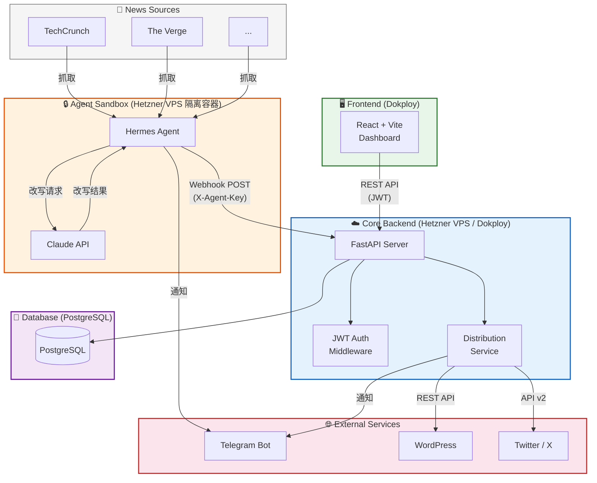
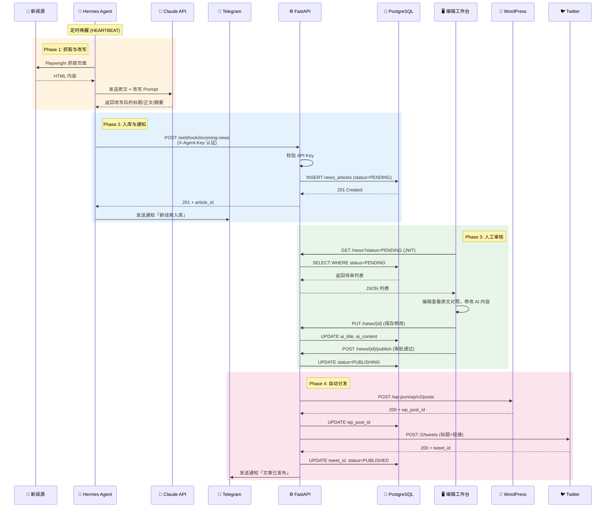
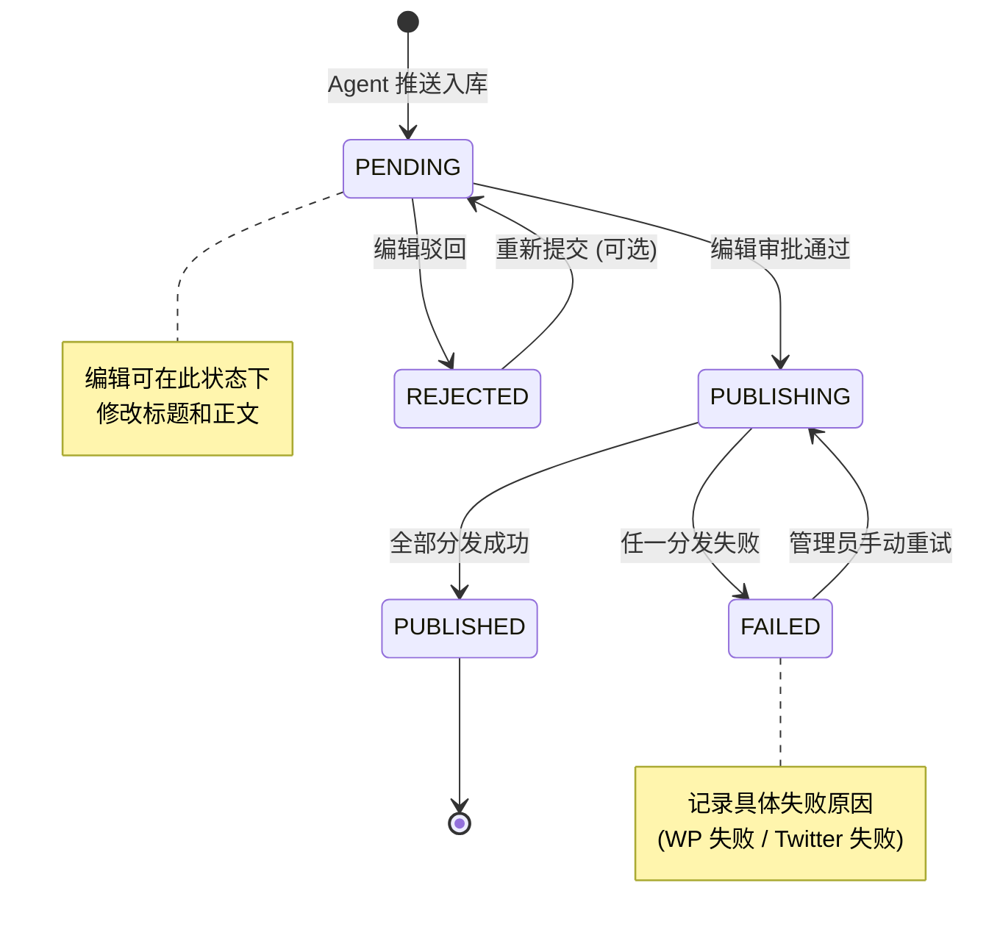
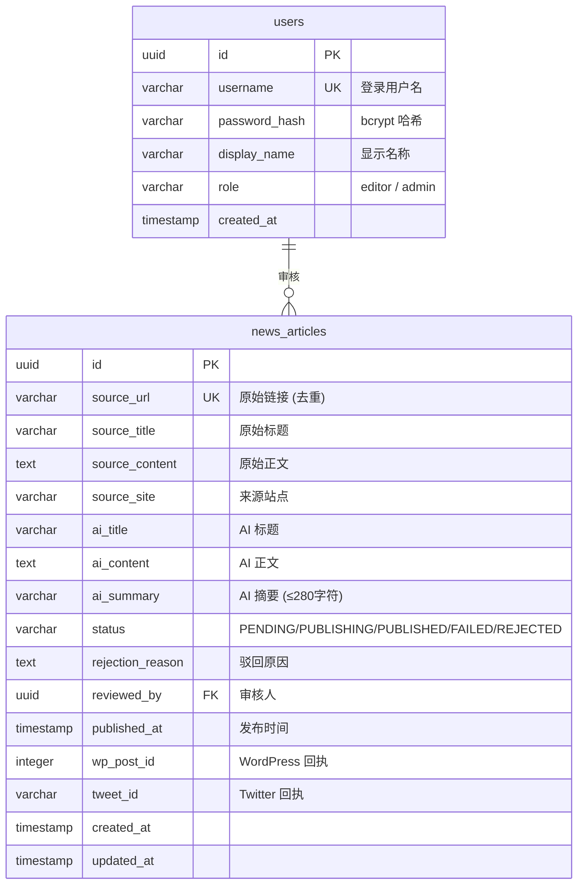
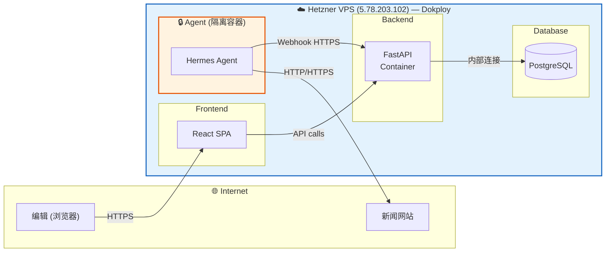
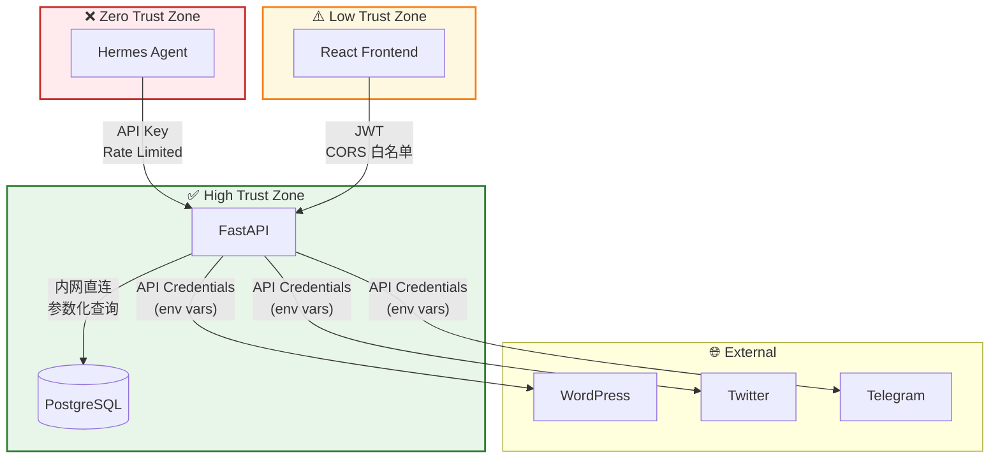

# 系统架构文档 (System Architecture)

> 本文档为 [HL-Intern-Project.md](../HL-Intern-Project.md) 的配套架构文档，使用 Mermaid 图表描述系统各层的关系与数据流。

---

## 1. 系统架构总览

### 架构要点

1. **Agent 层物理隔离：** Agent 运行在 Hetzner VPS 的隔离容器中，仅通过 HTTP Webhook 与核心后端通信，无法直连数据库
2. **核心后端集中处理：** FastAPI 作为唯一的数据入口和出口，统一管理认证、业务逻辑和第三方分发
3. **前端部署：** React SPA 通过 Dokploy 部署，通过 HTTPS 调用 API
4. **分发层解耦：** WordPress 和 Twitter 的分发相互独立，单个失败不影响另一个

---

## 2. 核心数据流：新闻从抓取到发布

---

## 3. 状态机详解

### 状态说明

| 状态 | 含义 | 允许的操作 |
| :--- | :--- | :--- |
| `PENDING` | 待审核 | 编辑修改、审批、驳回 |
| `PUBLISHING` | 分发中 | 等待（后端自动处理） |
| `PUBLISHED` | 已发布 | 只读 |
| `FAILED` | 分发失败 | 管理员重试 |
| `REJECTED` | 已驳回 | 可重新提交至 PENDING |

---

## 4. ER 数据模型

---

## 5. 部署拓扑

### 部署细节

| 组件 | 平台 | 配置 |
| :--- | :--- | :--- |
| FastAPI | Hetzner VPS (Dokploy) | 容器化部署 |
| PostgreSQL | Hetzner VPS (Dokploy) | 本地数据库实例 |
| React Frontend | Hetzner VPS (Dokploy) | 自动 CI/CD，绑定 GitHub 仓库 |
| Hermes Agent | Hetzner VPS (Dokploy 隔离容器) | 受限环境运行 |

---

## 6. 安全边界

### 信任边界说明

- **Zero Trust (Agent):** Agent 被视为不可信组件，所有来自 Agent 的数据均需校验。API Key 可随时轮换。
- **Low Trust (Frontend):** 前端用户已通过 JWT 认证，但仍需后端做权限校验和输入清洗。
- **High Trust (API ↔ DB):** 内网通信，使用 ORM 参数化查询，信任度最高。
- **External Services:** 使用各平台官方 API，凭证通过环境变量管理，不硬编码。
