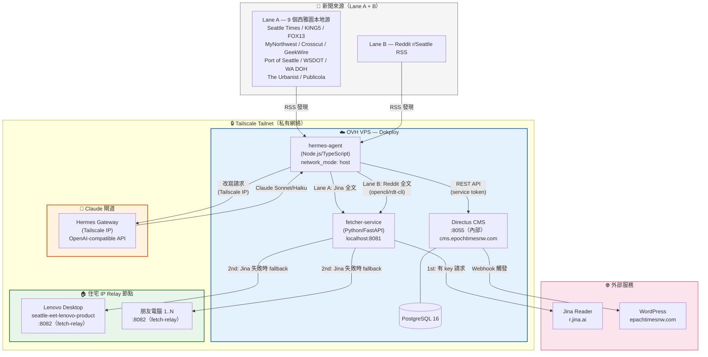
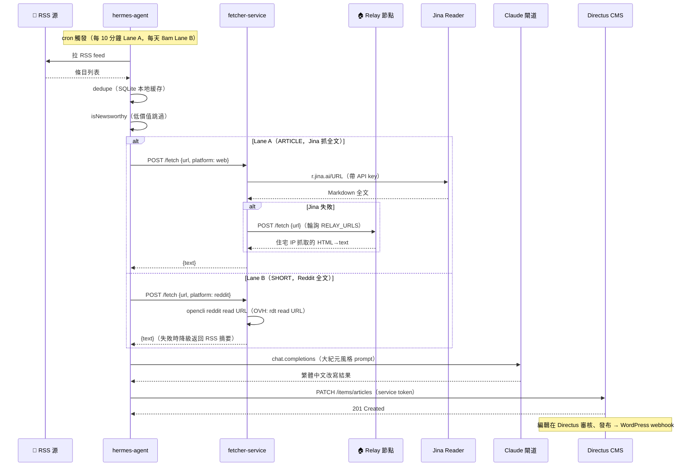
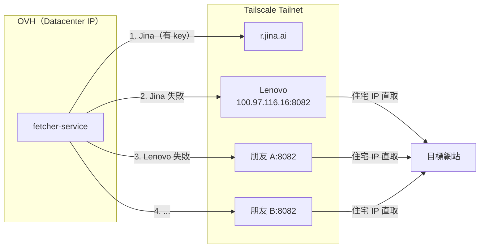

# 系統架構文檔

> epochtimesnw.com 新聞自動化流水線的實際部署架構。
> 部署平台：OVH VPS + Dokploy + Traefik。最後更新：2026-06-30。

---

## 1. 系統總覽

```mermaid
graph TB
    subgraph sources["📰 新聞來源（Lane A + B）"]
        RSS_A["Lane A — 9 個西雅圖本地源\nSeattle Times / KING5 / FOX13\nMyNorthwest / Crosscut / GeekWire\nPort of Seattle / WSDOT / WA DOH\nThe Urbanist / Publicola"]
        RSS_B["Lane B — Reddit r/Seattle RSS"]
    end

    subgraph tailnet["🔒 Tailscale Tailnet（私有網絡）"]
        subgraph ovh["☁️ OVH VPS — Dokploy"]
            Directus["Directus CMS\n:8055（內部）\ncms.epochtimesnw.com"]
            PG[("PostgreSQL 16")]
            Hermes["hermes-agent\n(Node.js/TypeScript)\nnetwork_mode: host"]
            Fetcher["fetcher-service\n(Python/FastAPI)\nlocalhost:8081"]
        end

        subgraph residential["🏠 住宅 IP Relay 節點"]
            Lenovo["Lenovo Desktop\nseattle-eet-lenovo-product\n:8082（fetch-relay）"]
            Friends["朋友電腦 1..N\n:8082（fetch-relay）"]
        end

        subgraph claude_gw["🧠 Claude 閘道"]
            Gateway["Hermes Gateway\n(Tailscale IP)\nOpenAI-compatible API"]
        end
    end

    subgraph external["🌐 外部服務"]
        Jina["Jina Reader\nr.jina.ai"]
        WP["WordPress\nepachtimesnw.com"]
    end

    %% 數據流
    RSS_A & RSS_B -->|"RSS 發現"| Hermes
    Hermes -->|"Lane A: Jina 全文"| Fetcher
    Hermes -->|"Lane B: Reddit 全文\n(opencli/rdt-cli)"| Fetcher
    Fetcher -->|"1st: 有 key 請求"| Jina
    Fetcher -->|"2nd: Jina 失敗時 fallback"| Lenovo & Friends
    Hermes -->|"改寫請求\n(Tailscale IP)"| Gateway
    Gateway -->|"Claude Sonnet/Haiku"| Hermes
    Hermes -->|"REST API\n(service token)"| Directus
    Directus --- PG
    Directus -->|"Webhook 觸發"| WP

    style ovh fill:#e3f2fd,stroke:#1565c0,stroke-width:2px
    style residential fill:#e8f5e9,stroke:#2e7d32,stroke-width:2px
    style claude_gw fill:#fff3e0,stroke:#e65100,stroke-width:2px
    style sources fill:#f5f5f5,stroke:#616161,stroke-width:1px
    style external fill:#fce4ec,stroke:#c62828,stroke-width:1px
```

---

## 2. 容器組成（docker-compose.prod.yml）

| 容器 | 網絡模式 | 監聽端口 | 說明 |
|------|---------|---------|------|
| `directus` | compose default + dokploy-network | 8055（內部） | CMS，Traefik 反代到 cms.epochtimesnw.com |
| `postgres` | compose default | 5432（內部） | Directus 專用 DB |
| `hermes-agent` | `host`（共享主機網絡） | — | 定時 cron，調 Tailscale 閘道需要 host 網絡 |
| `fetcher-service` | `host` | 127.0.0.1:8081 | Agent-Reach wrapper，僅 loopback |

> `hermes-agent` 和 `fetcher-service` 使用 `network_mode: host`，因為 Claude 閘道在 Tailscale tailnet 上，容器需要繼承主機的 Tailscale 網絡訪問權。代價：兩個容器不在 compose 內部網絡，Directus 走公網域名（`HERMES_DIRECTUS_URL`）。

---

## 3. 新聞流水線數據流

```mermaid
sequenceDiagram
    participant RSS as 📰 RSS 源
    participant HA as hermes-agent
    participant FS as fetcher-service
    participant Relay as 🏠 Relay 節點
    participant Jina as Jina Reader
    participant GW as Claude 閘道
    participant Dir as Directus CMS

    Note over HA: cron 觸發（每 10 分鐘 Lane A，每天 8am Lane B）

    HA->>RSS: 拉 RSS feed
    RSS-->>HA: 條目列表

    HA->>HA: dedupe（SQLite 本地緩存）
    HA->>HA: isNewsworthy（低價值跳過）

    alt Lane A（ARTICLE，Jina 抓全文）
        HA->>FS: POST /fetch {url, platform: web}
        FS->>Jina: r.jina.ai/URL（帶 API key）
        Jina-->>FS: Markdown 全文
        alt Jina 失敗
            FS->>Relay: POST /fetch {url}（輪詢 RELAY_URLS）
            Relay-->>FS: 住宅 IP 抓取的 HTML→text
        end
        FS-->>HA: {text}
    else Lane B（SHORT，Reddit 全文）
        HA->>FS: POST /fetch {url, platform: reddit}
        FS->>FS: opencli reddit read URL（OVH: rdt read URL）
        FS-->>HA: {text}（失敗時降級返回 RSS 摘要）
    end

    HA->>GW: chat.completions（大紀元風格 prompt）
    GW-->>HA: 繁體中文改寫結果

    HA->>Dir: PATCH /items/articles（service token）
    Dir-->>HA: 201 Created

    Note over Dir: 編輯在 Directus 審核、發布 → WordPress webhook
```

---

## 4. 改寫風格（Epoch Times NW）

hermes-agent 統一用《大紀元》西雅圖版風格改寫：

| 項目 | 規範 |
|------|------|
| 語言 | 繁體中文，台灣用語（資訊/軟體/網際網路） |
| 引號 | 「」書名《》省略號…… 破折號—— |
| 署名 | `【YYYY年MM月DD日訊】（本報綜合編譯）` |
| 人名 | 首次：中文音譯（English Full Name），之後只用姓 |
| 數字 | 萬/億（1,400億美元）、百分比 %、英制+公制並列 |
| Lane A | 500–900 字深度報導，Claude Sonnet |
| Lane B | 150–300 字快訊，Claude Haiku |

---

## 5. fetch-relay 住宅 IP 網絡

```mermaid
graph LR
    subgraph ovh["OVH（Datacenter IP）"]
        FS["fetcher-service"]
    end

    subgraph tailnet["Tailscale Tailnet"]
        FS -->|"1. Jina（有 key）"| Jina["r.jina.ai"]
        FS -->|"2. Jina 失敗"| L["Lenovo\n100.97.116.16:8082"]
        FS -->|"3. Lenovo 失敗"| F1["朋友 A:8082"]
        FS -->|"4. ..."| F2["朋友 B:8082"]
    end

    L & F1 & F2 -->|"住宅 IP 直取"| Web["目標網站"]
```

每個 relay 節點是一個極簡 Python HTTP 服務（`fetch-relay/relay.py`），監聽在 Tailscale IP 上，公網不可達。

---

## 6. 新聞源清單

### Lane A — 深度報導（ARTICLE，500–900 字）

| 源 | RSS URL | 分類 |
|----|---------|------|
| Seattle Times | seattletimes.com/feed/ | Local |
| KING 5 | king5.com/feeds/syndication/rss/news | Local |
| FOX 13 Seattle | fox13seattle.com/rss.xml | Local |
| MyNorthwest | mynorthwest.com/feed/ | Local |
| Cascade PBS (Crosscut) | cascadepbs.org/articles/briefs/rss/ | Local |
| GeekWire | geekwire.com/feed/ | Local |
| Port of Seattle | portseattle.org/rss.xml | Local |
| WSDOT | wsdot.wa.gov/rss.xml | Local |
| WA DOH | doh.wa.gov/rss.xml | Local |
| The Urbanist | theurbanist.org/feed/ | Housing & Urban |
| Publicola | publicola.com/feed/ | Politics |

### Lane B — 快訊（SHORT，150–300 字）

| 源 | 取材方式 |
|----|---------|
| Reddit r/Seattle | agent-reach（rdt-cli/opencli），失敗降級 RSS |

---

## 7. 安全邊界

| 組件 | 認證方式 | 網絡 |
|------|---------|------|
| hermes-agent → Directus | service account static token | 公網 HTTPS |
| hermes-agent → Claude 閘道 | API key | Tailscale（私有） |
| hermes-agent → fetcher-service | 無（loopback 127.0.0.1） | host loopback |
| fetcher-service → relay 節點 | 無（Tailscale 做網絡隔離） | Tailscale（私有） |
| Directus → WordPress | WordPress App Password | 公網 HTTPS |
| 編輯 → Directus | Authentik OIDC SSO | 公網 HTTPS |
