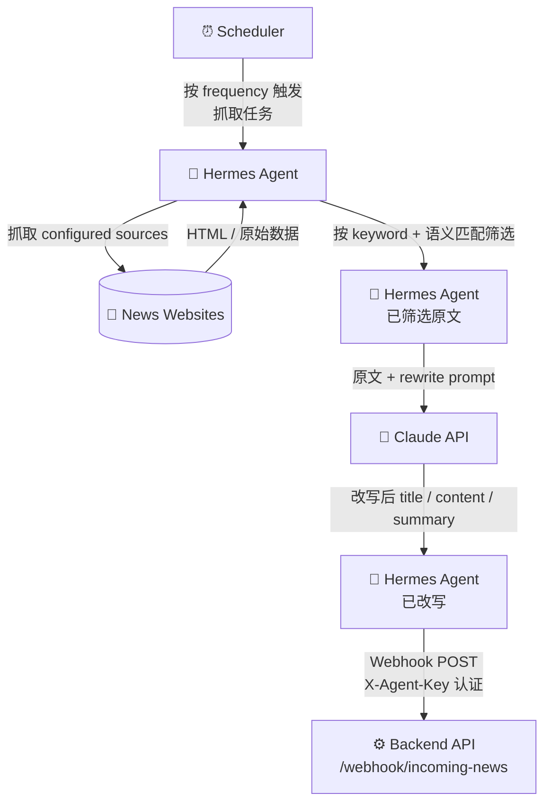
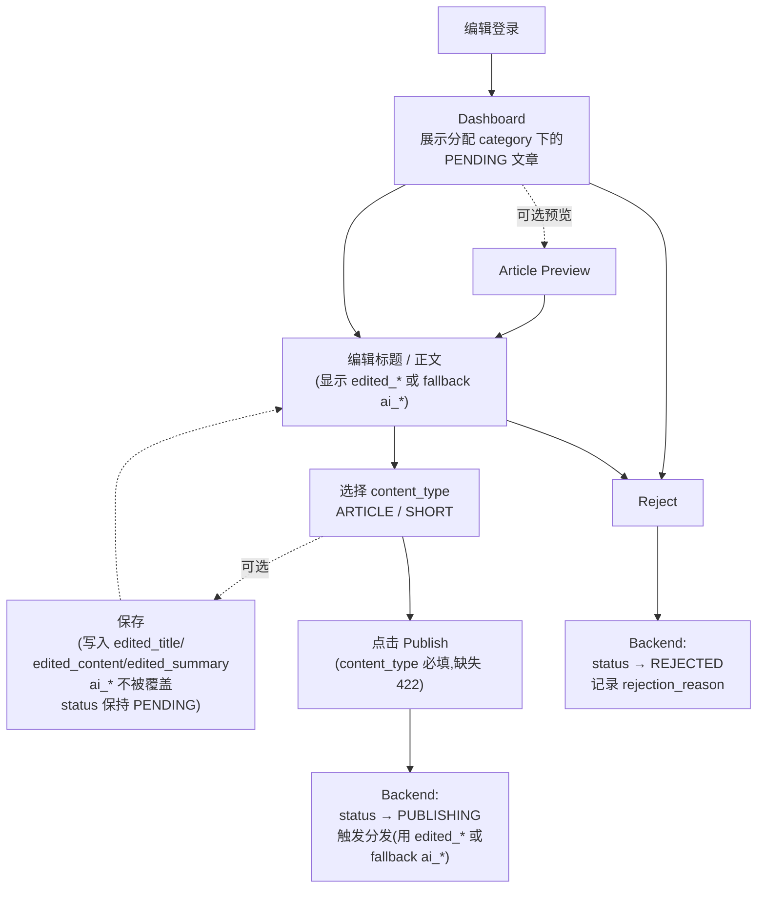
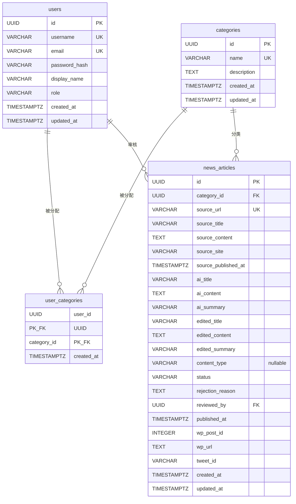

> **📝 关于本文档**
>
> 这份是 **High-Level Design (HLD)**,从原 Google Doc 迁移到仓库管理。
>
> 与 [`HL-Intern-Project.md`](../HL-Intern-Project.md) 的关系:
> - `HL-Intern-Project.md` 偏 **spec**(已敲定的技术选型、schema、API、里程碑)
> - 本文档偏 **design**(模块责任拆解、设计思路、未决问题)
>
> 当前状态:**草稿,持续完善中**。Backend Module 已较完整;Frontend / Database / Distribution / DFD / Interface Design / Deployment 等章节待补。
>
> 文档中的标注:
> - `> 🚧 TODO`: 待填写或待细化
> - `> ❓ 思考`: 设计思考点(部分已答 ✓,部分待定)

---

# AI News Curation Agent & Publishing Pool — HLD

## Why?

目前新闻处理流程依赖人工完成,包括新闻的寻找、整理、改写和发布。这种方式存在以下问题:

- 流程耗时较长需要 1-2 小时,影响新闻发布的时效性
- 存在大量重复性工作,造成人力浪费
- 审核与发布流程缺乏统一机制
- 缺少有效的状态追踪与错误处理机制
- 内容深度有限,改写结果容易同质化,缺乏针对目标受众的实用信息与内容相关性

## What?

构建一个由 AI Agent 支持的新闻处理与发布系统,自动化新闻抓取和内容改写流程,并在人工审核与确认后,由系统统一完成多平台发布。同时,需要系统支持对内容及发布状态的追踪,方便后续问题定位与处理。

## How?

### System Architecture

> 🚧 **TODO**: 补充文字版架构描述(目前只有 excalidraw 链接,链接随时可能失效)

**Sequence Diagram**: [Excalidraw 链接](https://excalidraw.com/#json=A4dfJt48xCP9XuqaDKnkv,BQp-6IJr4c3_Oz71EpIp8Q)

**User 角色**: editor

> ❓ **思考**: Admin 让不同编辑看到不同偏好?
> _类编辑只能看到_类文章,article 属于哪些栏目(一对多),编辑和栏目是一对多。

---

### Modules and Components

#### Agent Module

**Responsibility**:
Agent 模块负责从外部的新闻源抓取新闻并且调用 AI 改写,将处理后的新闻数据通过 Webhook 推送到后端。

**Category 分配机制**:Agent 用 AI 关键词匹配 + 语义匹配判断每篇文章属于哪个 `category`(`categories` 表中的话题分类,如 Medical / Politics / Finance / AI)。每个 category 在 admin 配置时关联一组 keyword,Agent 抓到原文后:

1. 关键词预筛(快速过滤明显不相关的)
2. 调 Claude API 用 prompt:_"下面这篇文章属于以下 categories 中的哪一个?[列表]。返回最匹配的一个 category name 和匹配置信度 0-1"_
3. 取置信度最高的 category 作为这篇文章的归属

**每篇文章对应一个 category**(MVP 简化,不做多对多),Webhook 提交时把 `category` name 一起送给 Backend。

**Input**:
- source 名称
- seed URLs
- frequency

**Processing**:

Agent 根据抓取频率通过 scheduler 定时触发抓取任务。
- 高频新闻源每 10 分钟轮询一次
- 中频新闻源每天轮询一次

抓取过程中对每个新闻源应用基本的 rate limiting,以避免目标网站的访问限制。

Agent 在抓取和改写过程中会处理以下异常情况:
- 网络请求失败
- 页面解析失败
- AI API 调用失败

对于临时性错误,Agent 会进行(三?)次数重试;如果仍然失败,则记录错误并跳过该任务。

> 🚧 **TODO**: 确认重试次数(目前写的"三?")

Agent 抓取新闻源页面后,提取有效信息,包括:
- 原始标题
- 正文
- 文章链接
- 来源站点
- 发布时间

随后调用 AI API 对标题和正文进行改写,生成给编辑审核的草稿。

> ❓ **思考**: 文章类的用什么类型的数据库存? → **PostgreSQL** ✓

**Processing Flow**:



**Output**:

Agent 输出结构化新闻数据,包括:
- 原始新闻链接(`source_url`)
- 原始标题(`source_title`)
- 原始正文(`source_content`)
- 来源信息(`source_site`)—— 原始网站,如 "Reuters"
- 原新闻在源站点的发布时间(`source_published_at`)
- AI 改写后的标题(`ai_title`)
- AI 改写后的正文(`ai_content`)
- AI 生成的摘要(`ai_summary`)
- **AI 判定的话题分类(`category` name)** —— 如 "Medical",Backend 解析为 `category_id` 后入库

**Edge cases(category 分配)**:

| 场景 | 处理 |
|---|---|
| 一篇匹配多个 category(置信度都不低) | Agent 选**置信度最高**的那个,只送一个 `category` |
| 所有 category 都不匹配(最高置信度 < 阈值,如 < 0.5) | Agent **跳过**这篇,不发 webhook,日志记录"unclassifiable" |
| Backend 收到不存在的 `category` name(如 admin 改了 category 名但 Agent 配置没同步) | Backend 返回 `400 Bad Request`,Agent 记录后跳过,**同时 Telegram 告警** |
| Agent 抓到符合多 category 的文章但都不强 | 同"所有 category 都不匹配",跳过更安全(避免错分类污染编辑列表) |

> 🚧 **TODO**: 置信度阈值定多少?初步建议 0.5,跑起来后调整。

---

#### Backend Module

**Responsibility**:

Backend 主要负责系统的核心业务逻辑,包括:
- Webhook 的安全接入(鉴权、限流)
- 新闻数据的去重、标准化处理和存储
- 新闻的状态管理和角色权限控制

> ❓ **思考**: 后端用什么框架比较好? → **NestJS** ✓

所有数据统一通过 Backend API 进行读写,**不允许其他模块直接操作数据库**。

Backend 同时为前端提供接口,支持编辑查看新闻、修改内容、标记内容类型,并把修改后的数据存入数据库,同时记录编辑历史和版本信息,方便后续回溯。

在分发方面,Backend 会根据新闻的内容类型,将处理后的内容发送到 WordPress 或 Twitter,并负责和 Telegram 进行通知交互。发布完成后,会把发布结果(比如链接、状态或者失败原因)写回数据库。

对于外部服务调用失败的情况,Backend 会进行重试,同时记录错误日志,方便排查问题,保证整个流程是可追踪、可恢复的。

**Input**:

- **From Agent/webhook**: 抓取到的新闻数据、webhook 鉴权信息
- **From Frontend**: 编辑修改后的 news 信息、`content_type`、editor action、用户权限信息
- **From External Services**: WordPress / Twitter 的 response、Telegram 的 response

**Processing**:

##### Webhook processing

Backend 接受 webhook 请求之后会先验证请求中的认证信息(如 API key 或签名),并进行速率限制控制,增强系统安全性。

> ❓ **思考**: webhook 好还是用 API 好? → **Agent 里用 webhook 合适** ✓

Backend 接收 webhook 传来的数据后,会先对原始新闻数据进行**标准化处理**,包括:
- 清洗文本内容
- 统一字段格式(如标题、来源、时间)
- 规范化 `source_url`

之后根据标准化后的 `source_url` 在数据库中查询该新闻是否已存在:
- **不存在**:创建一条新的 `news_articles` record,并将状态设置为 `PENDING`
- **已存在**:跳过创建,避免重复入库

##### Frontend editing processing

> 🚧 **TODO**: module 之间 interface 怎么交互的?API 长成什么样?主要的 API 列出来。

后端收到前端的 API 请求,解析出用户的身份信息(JWT TOKEN),并根据用户角色进行权限校验,选择这个用户是(editor/admin)。Backend 会根据不同 endpoint 执行对应处理。

**如果用户是 editor**:

1. **获取新闻**:编辑从前端发出获取新闻请求,后端从 DB 读出对应的新闻并发给前端(返回 `ai_*` 原文 + `edited_*` 编辑修改;前端若 `edited_*` 为 NULL 则显示 `ai_*`)

2. **保存(save)**:Backend 把编辑修改的内容写入 `edited_title` / `edited_content` / `edited_summary` 字段,**不覆盖 `ai_*` 原文**,**`status` 保持 `PENDING`**(MVP 不引入 DRAFT 状态,不维护版本历史)。同时检查请求里的 `updated_at`,实现 optimistic concurrency。

3. **发布(publish)**:
   - 请求中带上编辑修改后的内容和 `content_type`
   - Backend 收到请求后,先从用户身份信息(JWT)中获取 `user_id`,并**校验 `content_type` 不为 NULL**(`content_type` 在 schema 中是 nullable,但发布时必填,缺失返回 `422 Validation Error`)
   - 校验通过后,Backend 把编辑修改写入 `edited_*` 字段、记录 `reviewed_by = user_id`,并把 `status` 更新为 `PUBLISHING`
   - 随后 Backend 根据 `content_type` 选择发布路径(发布时**优先使用 `edited_*`,若 NULL 则 fallback 使用 `ai_*`**):
     - **ARTICLE**: 先发布到 WordPress,成功后保存 `wp_post_id` + `wp_url`,再将该链接发布到 Twitter
     - **SHORT**: 直接发布到 Twitter(用 summary 内容)
   - 最后 Backend 根据发布结果更新新闻的最终状态(`PUBLISHED` 或 `FAILED`)

4. **驳回(reject)**:Backend 更新状态为 `REJECTED`,记录 `rejection_reason` 到 `news_articles`

> 🚧 **TODO**: User 怎么和 interface 交互?admin / editor 通过前端交互,不同权限和前端有哪些功能交互。Agent 算是一个特殊的 user。

##### Publishing processing

在发布过程中,如果 WordPress 或 Twitter API 调用失败,Backend 会根据 retry 策略进行有限次数重试。如果重试后仍然失败,Backend 会把新闻 `status` 更新为 `FAILED`,并把错误详情写入文章的错误字段(per-platform 错误字段的最终方案见 Database Module 的 Open Schema Decisions #2),供 admin 后续手动 retry。MVP 阶段不引入独立的 `publish_logs` 表,完整重试历史推迟到 Phase 2。

##### Notifying processing

Backend 会在以下事件发生时发送 Telegram 通知:
- 新新闻进入系统
- 新闻被拒绝
- 发布成功
- 发布失败

通知内容由 Backend 根据事件类型生成,并通过 Telegram Bot API 发送。发送结果和错误信息会被记录,方便后续排查。

##### Logging

系统记录完整的日志信息,包括抓取处理和发布过程中的状态变化,以便问题排查和系统监控。

**Output**:

- 返回给前端的新闻数据、编辑结果和发布状态
- Webhook 请求的响应
- 发送到 WordPress 和 Twitter 的发布内容
- 发送到 Telegram 的通知消息

---

#### Frontend Module

> 📌 **关于本节**:页面规格内容来自 `permission-flow.md` 的 Frontend behavior 章节(已合并到此)。
>
> **MVP 阶段的关键调整**:
> - **claim / unclaim 机制不实现**:编辑直接打开文章编辑,并发冲突由后端通过 `updated_at` optimistic concurrency 检测;冲突时返回 `409 Conflict`,前端提示"内容已被他人修改,请刷新重试"。
> - **没有 DRAFT 状态**:编辑保存的稿子文章状态保持 `PENDING`,内容写入 `edited_title` / `edited_content` / `edited_summary` 字段(`ai_*` 原文不被覆盖)。
> - **`categories` 用于编辑路由**:editor 只看自己被分配的 category 下的文章。`source_site`(原始网站,如 Reuters)和 `category`(话题,如 Politics)是两个维度,**不要混淆**。

##### Editor Interaction Flow

编辑在工作台的完整动线:



> 实线 = 必经路径,虚线 = 可选分支。**并发冲突**:若后端检测 `updated_at` 不一致,返回 `409`,前端提示刷新并重新编辑。

##### Sidebar Navigation

The editor dashboard contains a left sidebar navigation for quick access to different article workflows and states.

Navigation items:
- Dashboard
- Available Articles
- Published
- Failed

> **备注**:MVP 没有独立的 "My Drafts" 页 —— 没有 DRAFT 状态,所有"编辑改过但还没发布"的稿子都是 `PENDING`,直接出现在 Available Articles 里。

##### Dashboard Overview Page

The dashboard overview page provides editors with a quick summary of their workload and recent activity.

The dashboard acts as an overview hub instead of a full article management page.

The overview page may include:
- Recent `PENDING` articles in the editor's assigned categories
- Recent activity (recently published / rejected, etc.)
- Quick statistics

Each section may display only a small number of recent items with a "View All" action that redirects to the corresponding full page.

##### Available Articles Page

The Available Articles page displays the full list of `PENDING` articles from categories assigned to the current editor.

This page may support:
- Pagination
- Search
- Filtering (by `category`, `source_site`, `content_type`)
- Sorting

Each article row may display:
- Article title
- **Category tag**(话题,如 "Politics")
- **Source site**(原始网站,如 "Reuters")
- Preview button
- Edit button

Category should be displayed as a colored tag/label for quick identification.

Editors can:
- Preview article details
- Open an article for editing _(no claim required)_

##### Article Preview Page

The preview page allows editors to review the full article information before editing.

The preview page may include:
- Article title
- Original source name (`source_site`)
- Original URL (`source_url`)
- Original published time (`source_published_at`), if available
- Crawled time (`created_at`)
- Original article content (`source_content`)
- AI rewritten title/content (`ai_title` / `ai_content`)
- Current category (`category_id` → name)
- Content type (`content_type`)
- Related metadata from the agent

Available actions:
- Back to Available Articles
- Edit
- Reject article

##### Article Editing Page

When an editor opens an article for editing, the system shows the editing workspace.

The editing page may include:
- Editable article title(显示 `edited_title`,若 NULL 则 fallback 显示 `ai_title`)
- Editable article content(显示 `edited_content`,若 NULL 则 fallback 显示 `ai_content`)
- Editable summary(显示 `edited_summary`,若 NULL 则 fallback 显示 `ai_summary`)
- AI 原文对照视图(只读,展示 `ai_title` / `ai_content` / `ai_summary`)
- Content type dropdown selection (`ARTICLE` / `SHORT`)
- Save button(写入 `edited_*` 字段,`status` 保持 `PENDING`,`ai_*` 不被覆盖)
- Publish button
- Reject button

> **重置回 AI 原版**:editor 可清空 `edited_*` 字段(对应 UI 上的"恢复 AI 原版"按钮),清空后页面显示自动 fallback 到 `ai_*`。

##### Frontend Validation Rules

- Editors **must select a `content_type` before publishing** an article(`content_type` 在 schema 中是 nullable,但 publish action 时后端校验非 NULL,缺失返回 `422`)。
- The Publish button should remain disabled until `content_type` is selected.
- Editors may save edits without publishing (`status` remains `PENDING`,内容写入 `edited_*` 字段,`ai_*` 永远保留为原文)。
- **Concurrent edits**:Edits use **optimistic concurrency**(后端检查 `updated_at`)。若有人在你 open 之后修改过同一篇,save / publish 时后端返回 `409 Conflict`,前端提示用户刷新并重新编辑。

##### Published Page

The Published page displays articles successfully published.

Editors can:
- View published article records
- Check final category and content type
- Open the published article link if available (`wp_url` / Twitter URL)

##### Failed Publishing Page

The Failed page displays articles that encountered publishing or distribution failures.

Editors may:
- View publishing error messages
- Retry failed publishing tasks
- Re-edit articles before retrying publishing

---

#### Database Module

**选型**:PostgreSQL 16

**表方案(MVP 4 张表)**:
- `users` —— 用户(editor / admin)
- `categories` —— 文章话题分类(如 Politics / Medical / Finance / AI)
- `user_categories` —— editor 与 category 的多对多关系(决定 editor 能看到哪些 category 下的文章)
- `news_articles` —— 文章主表

> 📦 **备注**:早期 6 表设计稿见 [`docs/archive/schema-v2.md`](archive/schema-v2.md)。MVP 暂不引入 `article_versions` / `publish_logs` 表,也不加显式 `claim` / `lock` 字段(改用 optimistic concurrency,见下方"设计决策")。Phase 2 视需求重新引入。

---

##### ER 图



**关系说明**:
- `users` ↔ `categories` **多对多**(通过 `user_categories` 关联):admin 把 editor 分配到一个或多个 category,editor 只能看到自己被分配 category 下的文章
- `categories` → `news_articles` **一对多**(通过 `news_articles.category_id`):一篇文章属于一个 category
- `users` → `news_articles` **一对多**(通过 `news_articles.reviewed_by`):一个 user 可以审核多条文章
- ⚠️ **`source_site` 不是 `category`**:`source_site` 是**原始网站**(如 Reuters / CNN / TechCrunch),`category` 是**文章话题**(如 Politics / Medical),两者维度不同,不要混淆

---

##### `news_articles` 表

| 字段名 | 数据类型 | 约束 | 说明 |
| :--- | :--- | :--- | :--- |
| `id` | UUID | PK, DEFAULT gen_random_uuid() | 主键 |
| `category_id` | UUID | NOT NULL, FK → categories.id | 文章话题分类(用于 editor 路由) |
| `source_url` | VARCHAR(2048) | UNIQUE, NOT NULL | 原始新闻链接(唯一约束,用于去重) |
| `source_title` | VARCHAR(500) | | 原始新闻标题 |
| `source_content` | TEXT | | 原始新闻正文(供编辑对照) |
| `source_site` | VARCHAR(100) | | 原始网站名称(如 "Reuters" / "TechCrunch"),**非话题分类** |
| `source_published_at` | TIMESTAMPTZ | | 原文在源站点的发布时间(与 `published_at` 区分) |
| `ai_title` | VARCHAR(500) | NOT NULL | AI 生成的**原始**标题(**不被覆盖**) |
| `ai_content` | TEXT | NOT NULL | AI 生成的**原始**正文(**不被覆盖**) |
| `ai_summary` | VARCHAR(280) | | AI 生成的**原始**摘要(用于 Twitter,≤280 字符,**不被覆盖**) |
| `edited_title` | VARCHAR(500) | | 编辑修改后的标题(NULL = 未修改;前端 fallback 显示 `ai_title`,发布时也 fallback) |
| `edited_content` | TEXT | | 编辑修改后的正文(NULL = 未修改;fallback 用 `ai_content`) |
| `edited_summary` | VARCHAR(280) | | 编辑修改后的摘要(NULL = 未修改;fallback 用 `ai_summary`) |
| `content_type` | VARCHAR(20) | **NULLABLE** | 分发路由:`ARTICLE` 走 WordPress+Twitter,`SHORT` 直发 Twitter。**Nullable**;发布前必填,后端在 publish action 时校验,缺失返回 `422` |
| `status` | VARCHAR(20) | NOT NULL, DEFAULT 'PENDING' | 见下方"状态机"小节 |
| `rejection_reason` | TEXT | | 驳回原因(`status=REJECTED` 时填写) |
| `reviewed_by` | UUID | FK → users.id | 审核人 |
| `published_at` | TIMESTAMPTZ | | 系统发布到外站的时间 |
| `wp_post_id` | INTEGER | | WordPress 文章 ID(发布回执) |
| `wp_url` | TEXT | | WordPress 完整 URL(前端展示用) |
| `tweet_id` | VARCHAR(50) | | Twitter 推文 ID(发布回执) |
| `created_at` | TIMESTAMPTZ | DEFAULT NOW() | 入库时间 |
| `updated_at` | TIMESTAMPTZ | DEFAULT NOW(), ON UPDATE | 最后修改时间(**用于 optimistic concurrency 版本检查**) |

**字段读 / 写规则**:
- **AI 原文不被覆盖**:`ai_title` / `ai_content` / `ai_summary` 永远保留 webhook 入库时的原始 AI 生成内容
- **编辑修改写入 `edited_*`**:editor 在 save / publish action 时,backend 把编辑改动写入 `edited_title` / `edited_content` / `edited_summary`
- **前端展示 fallback**:前端展示文章时,`edited_*` 字段为 NULL 则显示 `ai_*` 对应字段;非 NULL 则显示 `edited_*`
- **发布 fallback**:发布到 WordPress / Twitter 时,优先用 `edited_*`,为 NULL 则用 `ai_*`

> 🚧 **TODO**: `category_id` 在 webhook 入库时由谁决定?(选项:Agent 自己分类 / Backend 默认 "Uncategorized" / Backend 调用 AI 自动归类。需后续讨论。)

---

##### `users` 表

| 字段名 | 数据类型 | 约束 | 说明 |
| :--- | :--- | :--- | :--- |
| `id` | UUID | PK | 主键 |
| `username` | VARCHAR(50) | UNIQUE, NOT NULL | 登录用户名 |
| `email` | VARCHAR(255) | UNIQUE, NOT NULL | 邮箱(密码重置 / 唯一标识) |
| `password_hash` | VARCHAR(255) | NOT NULL | bcrypt 哈希后的密码 |
| `display_name` | VARCHAR(100) | | 显示名称(UI 展示用,不直接暴露登录名) |
| `role` | VARCHAR(20) | DEFAULT 'editor' | 角色:`editor` / `admin` |
| `created_at` | TIMESTAMPTZ | DEFAULT NOW() | 创建时间 |
| `updated_at` | TIMESTAMPTZ | DEFAULT NOW(), ON UPDATE | 最后修改时间(标准审计字段) |

---

##### `categories` 表

文章话题分类(如 Politics、Medical、Finance、AI),由 admin 管理。

| 字段名 | 数据类型 | 约束 | 说明 |
| :--- | :--- | :--- | :--- |
| `id` | UUID | PK, DEFAULT gen_random_uuid() | 主键 |
| `name` | VARCHAR(50) | UNIQUE, NOT NULL | 分类名(如 "Politics"、"Medical") |
| `description` | TEXT | | 可选描述 |
| `created_at` | TIMESTAMPTZ | DEFAULT NOW() | 创建时间 |
| `updated_at` | TIMESTAMPTZ | DEFAULT NOW(), ON UPDATE | 最后修改时间 |

---

##### `user_categories` 表

editor 与 category 的多对多关联表,决定 editor 在前端能看到哪些 category 下的文章。

| 字段名 | 数据类型 | 约束 | 说明 |
| :--- | :--- | :--- | :--- |
| `user_id` | UUID | PK, FK → users.id | 编辑用户 ID |
| `category_id` | UUID | PK, FK → categories.id | 分类 ID |
| `created_at` | TIMESTAMPTZ | DEFAULT NOW() | 分配时间 |

**复合主键**:`(user_id, category_id)`,天然防止重复分配。

---

##### 内容类型分发规则 (`content_type`)

**何时设置**:`content_type` 字段是 nullable,默认 NULL。Editor 在编辑界面选择 `ARTICLE` 或 `SHORT`,后端在 publish action 时校验非 NULL(缺失返回 `422`)。

**发布时取值**:发布到外站使用编辑修改 fallback 规则 —— `edited_*` 字段为 NULL 则用 `ai_*` 对应字段。

```
content_type = 'ARTICLE':
  → 1. 发布到 WordPress,使用 (edited_title || ai_title) + (edited_content || ai_content)
  → 2. 拿 wp_post_id + wp_url,用 wp_url 发推到 Twitter
  → status: PUBLISHING → PUBLISHED (两者都成功)
  → 失败: PUBLISHING → FAILED

content_type = 'SHORT':
  → 1. 直接发推到 Twitter,使用 (edited_summary || ai_summary)
  → status: PUBLISHING → PUBLISHED
  → wp_post_id / wp_url 字段保持 NULL
```

---

##### 设计决策

**为什么 MVP 用 4 张表(`users` / `categories` / `user_categories` / `news_articles`)?**
- editor 路由(医疗编辑只看医疗稿)是 MVP 必需功能,需要 `categories` + `user_categories` 显式建模
- 暂不引入 `article_versions` / `publish_logs` 表,这两项视为 Phase 2 演进

**为什么 `categories` 不能用 `source_site` 替代?**
- `source_site` = **原始网站**(Reuters / CNN / TechCrunch)
- `category` = **文章话题**(Politics / Medical / Finance / AI)
- 两者维度不同:Reuters 同时产 Politics 和 Medical 文章,按 `source_site` 分配 editor 会跨多个话题,**不符合"按话题路由"的需求**

**为什么加 `content_type`?为什么 nullable?**
MVP 必须支持两种发布类型:正式文章(ARTICLE,走 WP+Twitter)和短讯(SHORT,直发 Twitter)。设为 nullable 是因为入库时还不确定类型,由编辑在审核阶段选择;后端在 publish action 时校验非 NULL,缺失返回 `422`。

**为什么用 `edited_*` 字段而不是覆盖 `ai_*`?**
- 保留 AI 原文便于编辑对照(前端"原文 vs 修改后"对比视图直接用 `ai_*` vs `edited_*`)
- 任何时候都能"回到 AI 原版重新写"(editor 清空 `edited_*` 即可)
- 不需要单独的 `article_versions` 表也能保留最基本的"原始 vs 当前"两个版本
- 前端 / 发布逻辑用 fallback:`edited_*` 为 NULL 时回退到 `ai_*`

**为什么加 `source_published_at`?**
要区分"原文何时发布"和"我们何时转发布"。同一个字段表达不了两个语义。

**为什么加 `wp_url`?**
前端列表 / 通知里要能直接点开 WordPress 文章,光有 `wp_post_id` 还要拼接 URL。

**为什么加 `email`?**
现代 user 表标配 —— 密码重置、唯一标识、对接外部系统都需要 email。

**为什么加 `users.updated_at`?**
标准审计字段,原版未包含,补上。

**为什么不加 `claimed_by` / `claimed_at` 字段?(用 optimistic concurrency 替代)**
- 后端 / ORM 用 `news_articles.updated_at`(或 ORM 自带的 version 字段)做**版本检查**
- 前端编辑时记录当前 `updated_at`,提交时一并发回;后端比对,不一致返回 `409 Conflict`,前端提示"内容已被他人修改,请刷新重试"
- **不增加 schema 字段**,减少状态管理复杂度
- Phase 2 如需在 UI 上显示"Alice 正在编辑",再引入显式 claim 机制

**为什么 status 里没有 DRAFT?**
- MVP 简化:编辑保存后文章保持 `PENDING`,内容写入 `edited_*` 字段(`ai_*` 原文保留不动)
- 不维护版本历史(那是 `article_versions` 的事,Phase 2)
- 含义:"编辑改过但还没发布的稿" = "我正在审核中的某条 PENDING"

---

##### 索引(建议)

```
news_articles:
  - UNIQUE (source_url)         -- 去重
  - INDEX  (status)             -- 列表筛选高频
  - INDEX  (category_id)        -- editor 按 category 筛选高频
  - INDEX  (content_type)       -- 按类型筛选
  - INDEX  (created_at DESC)    -- 最新优先排序

users:
  - UNIQUE (username)
  - UNIQUE (email)

categories:
  - UNIQUE (name)

user_categories:
  - PRIMARY KEY (user_id, category_id)   -- 复合主键(天然唯一)
  - INDEX (category_id)                  -- 反向查询:此 category 下分配了哪些 editor
```

> 🚧 **TODO**: 索引清单是初步建议,实际跑起来根据查询模式调整。

---

##### 状态机

```
PENDING → PUBLISHING → PUBLISHED        (审批通过 → 分发 → 全部成功)
                    → FAILED → PUBLISHING   (分发失败 → 重试)
PENDING → REJECTED → PENDING                (可选,重新提交)
```

**MVP 5 个合法状态值**:`PENDING` / `PUBLISHING` / `PUBLISHED` / `FAILED` / `REJECTED`(**无 DRAFT**)。

**关键规则**:
- **草稿不是独立状态**:编辑保存后文章保持 `PENDING`,修改写入 `edited_*` 字段(`ai_*` 原文保留不动)
- **必经 `PUBLISHING` 中间态**:`PENDING` 不能直接到 `PUBLISHED`
- **`REJECTED → PENDING` 是 optional**:产品决定要不要支持"重新提交",MVP 可先不实现,只允许 REJECTED 作为终态

---

##### 亟待决定的问题 (Open Schema Decisions)

下面这些是 **schema 层**还没定的问题(只涉及"加什么字段 / 字段类型 / 约束 / 表结构",不涉及 API 或业务逻辑)。

| # | 问题 | 选项 | 优先级 / 状态 |
|---|---|---|---|
| 1 | **状态机的枚举值与流转** | ✅ **已决**:`PENDING` / `PUBLISHING` / `PUBLISHED` / `FAILED` / `REJECTED`(无 DRAFT)| ✅ 已决 |
| 2 | **per-platform 状态字段**:是否在 `news_articles` 加 `wp_status` / `tweet_status` / `wp_error` / `tweet_error` 等列 | A. 不加,只用单一 `status` / B. 加,精确追踪每平台 | 🟡 中 |
| 3 | **并发编辑保护字段** | ✅ **已决**:不加 `claimed_by` / `claimed_at`,改用 optimistic concurrency(后端 / ORM 用 `updated_at` 做版本检查) | ✅ 已决 |
| 4 | **`ai_summary` 长度约束**:`VARCHAR(280)` 对中文是否够 | Twitter 限 280 字符,中文按字算 + t.co 链接 23 字符 → 实际安全 ≤ 250 中文字符,可能要改 `VARCHAR(250)` | 🟢 低 |
| 5 | **软删字段**:是否加 `deleted_at` 列 | A. 硬删,不加 / B. 软删(在 `news_articles` / `users` / `categories` 加 `deleted_at TIMESTAMPTZ`) | 🟢 低(MVP 阶段可后议) |
| 6 | **`updated_by` 字段**:是否在 `news_articles` 加 `updated_by UUID FK→users.id` | A. 不加(`reviewed_by` 够了)/ B. 加,记录最后编辑人 | 🟢 低 |
| ~~7~~ | ~~`category_id` 入库时谁决定~~ | ✅ **已决**:A. Agent 通过 AI 关键词+语义匹配判断 category,webhook 传 `category` name,Backend 解析为 `category_id`。边界情况见 Agent Module 的 Edge cases 小节 | ✅ 已决 |

> 💡 **状态**:#1 / #3 / #7 已敲定;剩 #2 可以本周内决定;#4-6 等开始写代码时再决定。

##### Phase 2 推迟项(MVP 不做,后续可演进)

- `article_versions` 表 —— 版本历史 / 草稿历史 / 回滚
- `publish_logs` 表 —— 每次分发尝试一行,完整重试历史
- 显式 `claim` / `lock` 字段 —— 在 UI 显示"谁正在编辑"

详见已归档稿 [`docs/archive/schema-v2.md`](archive/schema-v2.md)。

---

#### Distribution Module

> 🚧 **TODO**: 待填写。需说明:
> - WordPress 发布路径(endpoint、认证、字段映射、回执)
> - Twitter 发布路径
> - 按 `content_type` 的分发策略
> - 失败处理与重试

---

### Data Flow Diagrams (DFDs)

> 🚧 **TODO**: 待填写。可参考 [`docs/architecture.md`](architecture.md) 的 Mermaid 图,或继续在 excalidraw 上画。

---

### Interface Design

> 🚧 **TODO**: 待填写。可链接到 [`docs/api-spec.md`](api-spec.md)(已有完整 API 请求/响应 schema),本节只需要列 endpoint 清单 + 简短说明。

---

### Deployment Architecture

> 🚧 **TODO**: 待填写。需说明:
> - Hetzner VPS + Dokploy
> - dev / prod 两套环境
> - 服务拓扑(frontend / backend / db / agent 容器)
> - 环境变量与 secrets 管理
> - HTTPS(Dokploy 自动 Let's Encrypt)
> - CI/CD pipeline

---

## Design Goals

- 将新闻从抓取、改写、审核到发布的整体流程从约 1–2 小时缩短到约 10 分钟,提高时效性
- 支持不同新闻类型(如文章与 breaking news)的差异化处理
- 在 AI 辅助生成内容的基础上保留人工审核机制,确保发布前经过编辑确认
- 建立统一的审核与发布流程,让每条新闻具有清晰状态,方便追踪
- 系统需要满足基本的可用性和性能要求:
  - Agent 定时抓取任务成功率目标为 **≥ 95%**
  - 后端 API 平均响应时间应控制在 **500ms 以内**

---

## Implementation Roadmap

按依赖顺序推进:

1. **ER 图 + 数据库的表** — 确定 schema
2. **设计 API** — 操纵数据的接口
3. **User 表** — 用户与权限交互
4. **设计 frontend** — 编辑工作台
5. **写测试** — 单元测试 + 集成测试

**阶段性目标**:

```
表确定了
  ↓
API 确定了 + migration
  ↓
写一些 code + 部署到 repo
  ↓
CI/CD
  ↓
服务器上了(研究 Dokploy dev/prod)
  ↓
Goal: API 可以调用了(测试可以跑通)
  ↓
Agent: 可以自己调用 API,n tasks frequency,prompt,调用 API → 数据库里有数据了
  ↓
Frontend: user interaction, CRUD, publish
  ↓
Goal: WordPress + Twitter 发布
  ↓
DONE!
```

---

## Version Bump

> 🚧 **TODO**: 此节标题原文是 "Version pump"(疑似 "Version bump"),内容待补 —— 是讲版本管理策略?还是发布 / semver?
