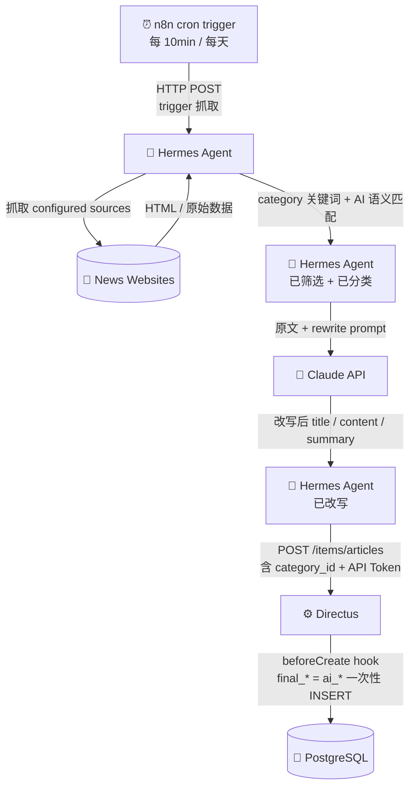
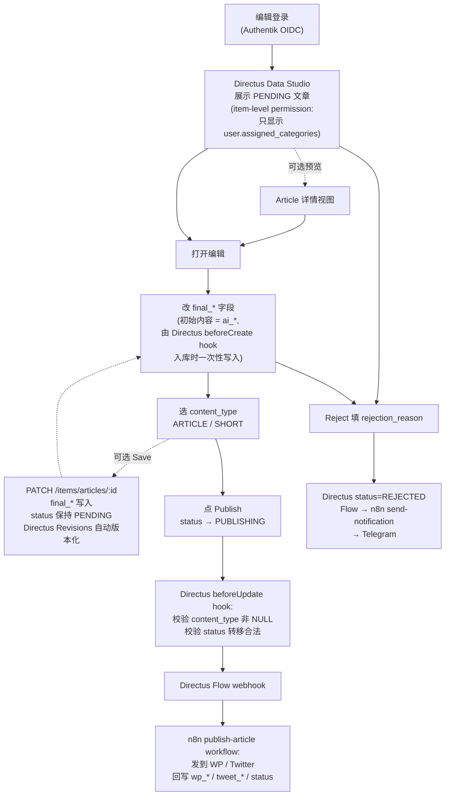
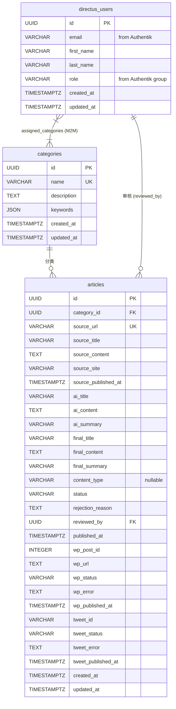
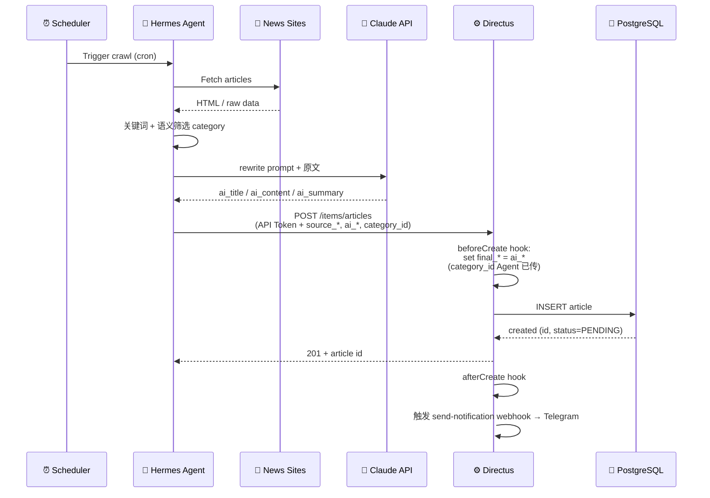
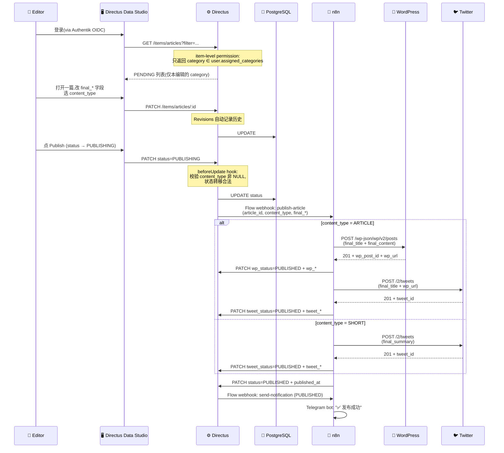
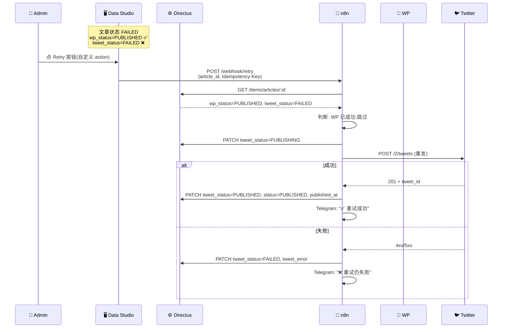

> **📝 关于本文档**
>
> 这份是 **High-Level Design (HLD)**,从原 Google Doc 迁移到仓库管理。
>
> 与 [`HL-Intern-Project.md`](../HL-Intern-Project.md) 的关系:
> - `HL-Intern-Project.md` 偏 **spec**(已敲定的技术选型、schema、API、里程碑)
> - 本文档偏 **design**(模块责任拆解、设计思路、未决问题)
>
> 当前状态:**MVP 架构定稿,采用 Directus-first**(Authentik + Hermes Agent + Directus + n8n + PostgreSQL,NestJS 为 Phase 2 候选)。所有主要章节均已填充,少量决策(`ai_summary` 字段是否要补 tweet_text 用途、Directus 并发冲突检测机制等)待 mentor 确认或 spike 时定稿,见 Database Module 的 Open Schema Decisions。
>
> 文档中的标注:
> - `> 🚧 TODO`: 待填写或待细化
> - `> ❓ 思考`: 设计思考点(部分已答 ✓,部分待定)

---

# AI News Curation Agent & Publishing Pool — HLD

## Why?

目前新闻处理流程依赖人工完成,包括新闻的寻找、整理、改写和发布。这种方式存在以下问题:

- 流程耗时较长需要 1-2 小时,影响新闻发布的时效性
- 存在大量重复性工作,造成人力浪费
- 审核与发布流程缺乏统一机制
- 缺少有效的状态追踪与错误处理机制
- 内容深度有限,改写结果容易同质化,缺乏针对目标受众的实用信息与内容相关性

## What?

构建一个由 AI Agent 支持的新闻处理与发布系统,自动化新闻抓取和内容改写流程,并在人工审核与确认后,由系统统一完成多平台发布。同时,需要系统支持对内容及发布状态的追踪,方便后续问题定位与处理。

## How?

### System Architecture

MVP 采用 **Directus-first 架构**,5 个核心组件:

| 层 | 组件 | 角色 |
|---|---|---|
| 身份层 | **Authentik** | SSO / MFA / 身份本体 |
| Agent 层 | **Hermes Agent**(独立 Node 服务)| 抓新闻 + 调 Claude 改写 + AI 分类 |
| 内容层 | **Directus**(CMS) | 内容存储 + admin UI + 权限 + Revisions + Flow |
| 自动化层 | **n8n** | publish 流程 + 通知 + retry + cron |
| 数据层 | **PostgreSQL** | shared DB(只 Directus 直接管 schema) |

(Phase 2 候选:**NestJS** —— 当 Directus hook / n8n workflow 不够用时再引入。详见下方"Component Responsibilities"。)

**Sequence Diagram**(Excalidraw,可能过时):[链接](https://excalidraw.com/#json=A4dfJt48xCP9XuqaDKnkv,BQp-6IJr4c3_Oz71EpIp8Q)

**User 角色**:`editor`(只看自己被分配的 category 下的文章)、`admin`(全部 + 管理权限)。

---

### Component Responsibilities

各组件 MVP 阶段的详细职责矩阵:

| 功能 | 负责 | 备注 |
|---|---|---|
| 登录 / SSO / MFA / 身份本体 | **Authentik** | source of truth |
| User role / group | **Authentik → Directus** | 从 Authentik 映射 |
| User ↔ Category assignment | **Directus** | 本地管理 |
| Categories CRUD | **Directus** | |
| 内容后台 UI / 基础 CRUD / RBAC | **Directus** | Data Studio |
| Revisions / 版本历史 | **Directus** | 内置 |
| Insights / 数据看板 | **Directus Insights** | 内置 |
| **Agent article ingestion** | **Directus**(`POST /items/articles`) | API token auth + field validation + unique constraint |
| Category name → id resolve | **Agent** | Agent 端 cache `/items/categories` 映射(**每轮抓取开始前刷新一次,或 cache TTL 5-10 min**,避免 admin 加新 category / 改 keyword 后 Agent 用旧数据),POST 时直接送 `category_id`。这样 POST body 跟 schema 完全对齐,Directus hook 不用做这一步 |
| 状态机 guard(合法 status 转移) | **Directus lifecycle hook** | MVP;状态变复杂时考虑 NestJS |
| Publish 触发器 | **Directus Flow**(监听 status 从 **non-PUBLISHING → PUBLISHING** 的转移,避免 n8n 回写字段时误触发) | |
| WP / Twitter publish 真发布 | **n8n** | workflow |
| 写回 per-platform 字段 | **n8n** | 调 Directus API,不直连 DB |
| Telegram 通知 | **n8n** | |
| cron schedule | **n8n** | |
| AI workflow orchestration | **n8n** | |
| Retry workflow / failure alert | **n8n** | |
| Claude API 调用 | **Agent**(MVP 唯一调用方) | Agent 在抓取流程内直接调 Claude 做改写 + 分类。n8n MVP 阶段**不调 Claude**,只管 cron / publish / notification / retry。**职责边界清晰** |
| 抓新闻 / rewrite / classification | **Hermes Agent + Claude** | |
| PostgreSQL | shared DB | **MVP 只允许 Directus 直接管 schema / CRUD;其他组件全部通过 Directus API 访问** |
| NestJS | **Phase 2 complexity layer** | MVP 不引入 |

**MVP 阶段不在主链路里的**(明确标记,避免误解):
- ❌ **NestJS** —— Phase 2 candidate
- ❌ **自定义 React 前端** —— 编辑直接用 Directus admin UI;Phase 2 视需求引入(那时配合 NestJS BFF)
- ❌ **`article_versions` 表** —— Directus Revisions 已覆盖
- ❌ **`publish_logs` 表** —— per-platform 字段 + n8n 执行日志已覆盖;Phase 2 如需完整重试历史再加

---

### Modules and Components

#### Agent Module

**Responsibility**:
Agent 模块负责从外部的新闻源抓取新闻并且调用 AI 改写,将处理后的新闻数据**通过 Directus REST API POST 入库**(`POST /items/articles`,Directus auto-gen 的标准 endpoint,**不是我们自己写的 webhook**)。

**Category 分配机制**:Agent 用 AI 关键词匹配 + 语义匹配判断每篇文章属于哪个 `category`(`categories` 表中的话题分类,如 Medical / Politics / Finance / AI)。每个 category 在 admin 配置时关联一组 keyword,Agent 抓到原文后:

1. 关键词预筛(快速过滤明显不相关的)
2. 调 Claude API 用 prompt:_"下面这篇文章属于以下 categories 中的哪一个?[列表]。返回最匹配的一个 category name 和匹配置信度 0-1"_
3. 取置信度最高的 category 作为这篇文章的归属

**每篇文章对应一个 category**(MVP 简化,不做多对多)。Agent 拿到 AI 判定的 name 后,**自己在本地 cache 里查到 `category_id`**,最后 POST 时**只送 `category_id`**(跟 articles schema 完全对齐)。

**Categories cache 刷新策略**:Agent **每轮抓取开始前 GET `/items/categories` 刷新一次,或 cache TTL 5-10 分钟**。理由:admin 可能加新 category / 改 keyword,Agent 启动时 cache 后不知道。这是必须的(否则"n8n 每 10 min 触发 Agent 但 Agent 分类依据旧 cache"会出问题)。

**Input**:
- source 名称 / seed URLs / category 关键词配置(由 admin 或 config 提供)
- **Cron 触发**:由 **n8n** 定时(cron schedule)触发 Agent 跑一轮抓取(详见下方 Processing Flow)

**Processing**:

**Agent 本身不带 cron,由 n8n cron 节点定时触发**(per Component Responsibilities 矩阵):
- 高频新闻源每 10 分钟轮询一次(n8n cron `*/10 * * * *`)
- 中频新闻源每天轮询一次(n8n cron `0 8 * * *`)
- 触发方式:n8n cron 节点 → HTTP POST 到 Agent 的 trigger endpoint,Agent 跑一轮即退出

抓取过程中对每个新闻源应用基本的 rate limiting,以避免目标网站的访问限制。

Agent 在抓取和改写过程中会处理以下异常情况(详见 Error Handling & Retry Strategy 章节):
- 网络请求失败(抓取新闻源)
- 页面解析失败
- AI API 调用失败(Claude rate limit / network)
- **Directus 写入失败**(网络 / 5xx / 422 校验错 / 422 unique 冲突)

对于**临时错误**(network / 5xx / rate limit),Agent 进行 **3 次指数退避重试**(1s → 2s → 4s);仍失败则记录错误并跳过该篇 + Telegram 告警。
对于**永久错误**,**按 error code / field 细分**:
- **422 + `source_url` unique conflict** → 文章已入过库,**静默跳过**(预期行为,不告警)
- **422 + 其他 validation error**(字段格式错、缺必填等)→ **log + Telegram 告警**(说明 Agent payload 有 bug,需要 admin 介入)
- **4xx auth fail** → log + 告警(API Token 配置错,需 admin 介入)

> 🚧 **TODO**: 确认重试次数(目前 3 次,实际跑起来根据失败率调整)

Agent 抓取新闻源页面后,提取有效信息,包括:
- 原始标题
- 正文
- 文章链接
- 来源站点
- 发布时间

随后调用 AI API 对标题和正文进行改写,生成给编辑审核的草稿。

> ❓ **思考**: 文章类的用什么类型的数据库存? → **PostgreSQL** ✓

**Processing Flow**:



**Output**:

Agent 把流程的结果打包成 JSON,**POST 到 Directus `/items/articles`**(用 Directus API Token 鉴权,放 `Authorization: Bearer <token>`)。

**POST body 字段**(Agent 负责填):

| 字段族 | 字段 | 说明 |
|---|---|---|
| 原始抓取 (`source_*`) | `source_url` / `source_title` / `source_content` / `source_site` / `source_published_at` | 直接从新闻源抓取 |
| AI 改写 (`ai_*`) | `ai_title` / `ai_content` / `ai_summary` | Claude 改写后的内容 |
| 分类 | `category_id`(**UUID**) | AI 判定 category name 后,**Agent 自己查 Directus** `GET /items/categories?filter[name][_eq]=Medical` 拿到 `id`,再 POST `category_id`(可启动时一次性 cache 全部 categories)。**这样 POST body 跟 articles schema 完全一致** |

**Agent 不负责的字段**(由 Directus / n8n / editor 后续填):

| 字段 | 谁填 | 何时 |
|---|---|---|
| `final_title` / `final_content` / `final_summary` | Directus lifecycle hook(`beforeCreate`,跟其他字段一起准备好后再 INSERT)| 入库时自动 `final_* = ai_*` 初始化 |
| `content_type` | Editor | 在 Data Studio 编辑时选 `ARTICLE` / `SHORT` |
| `status` | Directus | 默认 `PENDING`(字段 default);后续由 editor action / n8n 改 |
| `wp_*` / `tweet_*` | n8n publish workflow | 发布成功 / 失败时回写 |
| `reviewed_by` | `beforeUpdate` lifecycle hook,**只在 editor 把 status 从 PENDING → PUBLISHING 那一次写** | hook 显式写 `reviewed_by = currentUser.id`(Directus 不自动记)。**n8n 用 API token 后续 PATCH 时不能覆盖**(否则会变成 service account) |
| `published_at` | n8n | 整体 status 进入 `PUBLISHED` 时记录 |
| `id` / `created_at` / `updated_at` | Directus | 自动生成 / 维护 |

> 这样划分清楚是为了让以后写 Agent 代码的同学**知道自己该填什么、不该填什么**,避免 Agent 误填 status / final_* 等字段。

**Edge cases(category 分配)**:

| 场景 | 处理 |
|---|---|
| 一篇匹配多个 category(置信度都不低) | Agent 选**置信度最高**的那个,只送一个 `category` |
| 所有 category 都不匹配(最高置信度 < 阈值,如 < 0.5) | **MVP**:Agent **跳过**这篇,**不 POST 到 Directus**,日志记录 "unclassifiable"(理由:跳过更安全,避免错分类污染编辑列表)。**Phase 2 可以加 "Unclassified review queue"** —— 弱匹配文章入特殊状态 / 特殊 category(如 `Unclassified`),admin 定期审 + 人工归类 / 删除。这样既不漏新闻,又不污染主编辑流 |
| Agent cache 里查不到匹配 category(admin 加了新 category 但 Agent 没刷新 cache) | Agent **跳过这篇 + log + 触发 send-notification → Telegram 告警**(让 admin 知道要重启 Agent 或加 cache 热更新)|
| Agent 抓到符合多 category 的文章但都不强 | 同"所有 category 都不匹配",跳过更安全(避免错分类污染编辑列表) |

> 🚧 **TODO**: 置信度阈值定多少?初步建议 0.5,跑起来后调整。

---

#### Directus(CMS / 内容层)

**Responsibility**:Directus 是 MVP 的核心数据 + 业务层,承担:
- 内容存储(`articles` / `categories` collection)
- Admin UI(编辑和 admin 直接在 Data Studio 里操作)
- 用户权限(RBAC + item-level conditional permissions)
- 版本历史(Revisions,自动)
- Agent ingestion(auto-gen `POST /items/articles` endpoint)
- Lifecycle hooks(field validation、state guard、final_* 初始化等)
- Flow 触发器(监听字段变化,调外部 webhook)
- Insights(数据看板)

**详细配置**:

##### Content Types
详见下方 Database 章节。MVP 用 3 个 collection:
- `directus_users`(内置,加 M2M 字段 `assigned_categories`)
- `categories`(自定义)
- `articles`(自定义,即原 `news_articles`)

##### Permissions
- **editor role**:item-level 条件 —— 只能 R/W `category` ∈ `current_user.assigned_categories` 的 article
- **admin role**:全部访问 + 管理 categories 和 user 分配

##### Lifecycle Hooks(自定义代码)

> ⚠️ **Hook 复杂度阈值**:Directus hook **只做轻逻辑**(单字段校验、enum 转移检查、简单字段写入、字段级 immutable enforcement)。**如单个 hook 函数超过 ~50 行 / 需要跨表事务 / 需要复杂 if-else 业务规则 / 需要调外部服务**,**必须挪到 NestJS Phase 2**(详见 NestJS 章节"触发引入的信号")。原因:hook 跑在 Directus 进程内,出错没有独立 retry / observability;复杂逻辑很难测试;过度膨胀会让 Directus 难维护。

- `articles.beforeCreate`:
  - 规范化 `source_url`
  - **设置 `final_*` = `ai_*` 初始值**(跟其他字段一起准备好,只一次 INSERT,**不要放 afterCreate**,否则会触发多余的 UPDATE + Revision + updated_at 抖动)
  - (`category_id` 由 Agent 端 resolve 后直接 POST,Directus 不需要做这一步;详见 Agent Module Output)
- `articles.beforeUpdate`:**所有以下校验仅在 `status` 字段本身发生变化时执行**(`if oldRecord.status !== newRecord.status`),避免 n8n 多次 PATCH per-platform 字段时触发不必要的校验:
  - 状态转移合法性(只允许合法 `status` transition)
  - `content_type` 非 NULL 当 `status` 转为 `PUBLISHING`(缺失返 422)
  - **`reviewed_by` 写入规则**:**仅当 editor 把 `status` 从 `PENDING` 改为 `PUBLISHING` 时**写入 `reviewed_by = currentUser.id`。**n8n 用 API token 后续回写其他字段时不要覆盖 `reviewed_by`**(currentUser 是 service account,不能算"审核人")
  - 阻止任何角色直接改 `ai_*` 或 `source_*` 字段(也由 field permission 兜底)
- `articles.afterCreate`:
  - 触发 Telegram 通知 "新文章入库"(via n8n send-notification workflow)

**Hook 报错处理**:
- Hook 报错会**阻止当前 CRUD 操作**,返回错误给调用者(Agent / Data Studio / n8n)
- Hook **不会 retry**(代码 bug 要修,不是临时错误)
- 严重 hook 异常通过 `afterError` event(如果 Directus 支持)或包一层 try/catch 触发 send-notification → Telegram 告警 admin
- Hook 错误同时记入 Directus Activity Log(admin UI 可查)

##### Flows(可视化自动化)
- **"Publish Article" Flow**:
  - Trigger:`articles.status` 从 **non-PUBLISHING → PUBLISHING**(用 condition filter,避免 n8n 回写其他字段时误触发)
  - Action:调 n8n webhook,传 `article.id` + `content_type`
- **"Reject Article" Flow**(可选):
  - Trigger:`articles.status` 变成 `REJECTED`
  - Action:调 n8n,发 Telegram 通知

##### Auth 集成
Directus 配置 OIDC,指向 Authentik(详见 Authentik 章节)。

**Input / Output**:
- **Input**:Agent POST 文章、编辑在 Data Studio 的 CRUD、n8n 回写结果
- **Output**:REST + GraphQL API(给所有组件用)、Flow webhook(给 n8n)、Revisions(给历史查询)

---

#### n8n(自动化层)

**Responsibility**:所有外部 orchestration + API 调用 + cron,workflows 取代了原 NestJS distribution module 的位置。

**关键 Workflows**(详见 Distribution Module 章节):

1. **publish-article**:接收 Directus Flow webhook → 按 `content_type` 发到 WP / Twitter → 回写 Directus per-platform 字段
2. **retry-publish**:收到 retry 触发 → 读 per-platform 状态 → 只重试 FAILED 的平台
3. **send-notification**:Telegram 通知(新文章入库 / 发布成功 / 发布失败 / 被拒绝)
4. **scheduled-cleanup / health-check**(cron-based,Phase 2 可加)

**Idempotency**:MVP 简化版 —— n8n workflow 在调 WP / Twitter **之前先查 Directus 当前 `wp_status` / `tweet_status`**,**跳过已 PUBLISHED 的平台**。更严格的"按 idempotency-key dedup"是 Phase 2(可用 n8n workflow static data 缓存 / external Redis / Directus 字段标记)。

**Error Handling**:
- 临时错误(network、rate limit)→ n8n 自带 retry(指数退避)
- 永久错误(WP 配置错、auth fail)→ 把错误信息回写 Directus 的 `*_error` 字段 + 触发 Telegram 告警

**约束**:n8n 通过 **Directus REST API** 访问数据,**不直连 PostgreSQL**。

---

#### Authentik(身份层)

**Responsibility**:
- SSO / MFA / 账号管理
- OIDC provider,Directus 通过 OIDC 信任 Authentik

**集成方式**:
- Directus 配 OIDC SSO,指向 Authentik
- 编辑用 Authentik 账号登录,Directus 自动创建 / 同步 `directus_users` 记录
- **Role / group** 从 Authentik 映射:Authentik 的 `editor` group → Directus `editor` role
- **Category 分配**(`editor` 被分配到哪些 category)是 Directus admin 本地操作,**不从 Authentik 同步**

**MVP 实现细节**:
- Authentik 是公司已有基础设施
- 我们只需要在 Authentik 注册一个 OAuth client + 把 client_id/secret 配进 Directus
- **不需要写代码**

---

#### NestJS(Phase 2 Complexity Layer)

**MVP 不引入**。Phase 2 视具体复杂度场景再考虑。

**触发引入的信号**(任何一条出现时考虑加 NestJS):
- Directus lifecycle hook 单个写起来超过 ~50 行 / 需要复杂事务
- n8n workflow 调试维护难,需要 code-level 控制(unit test、版本管理、CI/CD)
- 出现自定义前端(给读者 / 给媒体 / 给 admin 的特殊视图),需要 BFF
- 跨多个外部系统的复杂业务校验或事务
- AI 调用要做精细管理(prompt 版本控制、token 计算、cost tracking)
- 复杂安全 / 审计要求,需要 application 层日志

**预设职责范围**(若引入):
- 自定义业务校验 / 复杂 orchestration
- BFF for 自定义前端
- 复杂 AI workflow
- 应用层日志 / metrics

**约束**:NestJS 通过 **Directus REST API** 访问数据,**不直连 PostgreSQL**(同 Agent / n8n 一致)。

---

#### Frontend(Directus Admin UI / Data Studio)

> 📌 **关于本节**:**MVP 不引入自定义 React / Vue 前端**。编辑和 admin 直接使用 Directus 自带的 **Data Studio**(admin UI)。
>
> **为什么 MVP 不上自定义前端**:
> - Directus Data Studio 已经包含我们需要的:列表 / 详情 / 富文本编辑 / 权限自动控制 / 状态过滤 / 数据看板
> - 节省时间(实习 2 个月,自定义前端从零开发可能占 30-40% 工作量)
> - Phase 2 若产品需要(给读者的网站、给媒体的演示页),那时再加(可能配合 NestJS BFF)
>
> **下文页面规格** 描述的是**编辑在 Directus Data Studio 里的对应视图**,**不是自定义前端的设计**。原页面规格来自 `permission-flow.md` 的 Frontend behavior 章节(已合并到此)。
>
> **MVP 阶段的关键约束**:
> - **claim / unclaim 机制不实现**:编辑直接打开文章编辑。⚠️ **关键说明:Directus Revisions 是事后留痕 / 可 restore 的工具,不等于并发保护** —— 它无法**阻止覆盖**。MVP 阶段接受 **last-write-wins** 风险(后保存的覆盖前保存的,通过 Revisions 可以追溯但不能阻止)。如果团队接受不了这个风险,Phase 2 加 optimistic lock(check `updated_at` / version field)或 claim / lock 字段
> - **没有 DRAFT 状态**:编辑保存的稿子文章状态保持 `PENDING`,修改写入 `final_*` 字段(由 Directus Revisions 自动跟踪历史)
> - **`categories` 用于编辑路由**:editor 只看自己被分配的 category 下的文章(Directus item-level permission 实现)
> - **`source_site`(原始网站)和 `category`(话题)是两个维度**,不要混淆

##### Editor Interaction Flow

编辑在 Directus Data Studio 里的完整动线:



> 实线 = 必经路径,虚线 = 可选分支。**⚠️ 并发冲突**:MVP **接受 last-write-wins 风险**(后保存覆盖前保存)。Directus Revisions 只能事后**追溯 / restore**,**无法阻止覆盖**。Phase 2 视团队接受度加 optimistic lock 或 claim / lock。

##### Editor 在 Data Studio 里的视图

> Directus Data Studio **自动渲染 admin UI**,**不做独立 React / Vue 前端**。但 **Publish / Reject / Retry 等自定义按钮 ≠ 零代码** —— 需要少量 **Directus extension**(custom interface / custom operation / custom panel)或 **Directus Flow 的 custom operation**。"配置"与"少量代码"是混合的,不是纯点鼠标。
>
> ⚠️ **MVP 退化路径**:如果 extension 工作量超预期,**MVP 可以先不写自定义按钮**,editor / admin **直接在 Data Studio 的字段编辑面板里手动改 `status`**(改成 `PUBLISHING` 触发 Flow,改成 `REJECTED` 填 `rejection_reason`)。按钮是 **UX enhancement**(更顺手),不是功能必需。Phase 2 真要上 polished 流程时再加 button。
>
> 下文 page-by-page 规格描述的是 Data Studio 里的配置 + 少量 custom action(理想态)。

**Sidebar Navigation**(editor role 可见):
- 📰 **Articles**(主工作区)
- 🏷️ **Categories**(只读,看 admin 维护的分类列表)
- 📊 **Dashboard / Insights**(自定义看板)

> ⚠️ **MVP 没有独立的 "My Drafts" 入口** —— 没有 DRAFT 状态,所有"编辑改过但还没发布"的稿子都是 `PENDING`,在 Articles 列表里用 saved preset 看就行。

---

**Articles 列表视图配置**:

| 配置项 | 设置 |
|---|---|
| **Item-level filter**(权限层强制,后端 enforce) | `category ∈ current_user.assigned_categories` —— editor 看不到不属于自己 category 的文章 |
| **默认 saved presets**(Directus bookmark) | "Pending(待审)" `status=PENDING` / "Recently Published" `status=PUBLISHED, sort by -published_at` / "Failed(需 retry)" `status=FAILED` |
| **列表显示字段** | title / status(色块)/ category(色块,话题色)/ source_site(原始网站)/ created_at |
| **可用 filter** | `status` / `category` / `source_site` / `content_type` / 日期范围 |
| **Search** | 全文搜 `final_title` / `source_title` |
| **排序** | 默认按 `created_at DESC`(最新优先) |

> **`source_site` 和 `category` 是不同维度**:`source_site = "Reuters"`(原网站),`category = "Politics"`(话题分类)。列表里**两个都显示** + **两个都能 filter**。

---

**Articles 详情 / 预览视图**(Directus 默认 item detail page):

Data Studio 自动展示所有字段,**按字段权限决定可见 / 可编辑**(下方 Article Editing Page 详述)。

- Source 字段(`source_*`):只读,供编辑核对原文
- AI 字段(`ai_*`):只读,对照看
- Final 字段(`final_*`):可编辑(editing 视图)
- 分发字段(`wp_*` / `tweet_*` / `published_at` 等):只读

**Available actions**(由 Directus 默认 + 自定义 button 提供):
- Edit(默认,直接进编辑模式)
- Reject(自定义 action 改 `status = REJECTED`,弹窗填 `rejection_reason`)
- Publish(自定义 action 改 `status = PUBLISHING`,触发 Flow webhook)

---

**Insights 看板**(自定义,给编辑日常用):

| 看板 | 给谁看 | 内容 |
|---|---|---|
| "My Pending" | editor | 自己 category 下的 `status=PENDING` 数量 + 最近 5 篇 |
| "My Recent Activity" | editor | 本周 published / rejected / failed 计数 |
| "Site Overview"(可选) | admin | 全站 status 分布、各 editor 工作量、发布失败率 |

Directus Insights 自带 panel 类型(number / chart / table / metric),配置即可,**无需写代码**。

##### Article Editing Page

编辑文章的视图(在 Directus Data Studio 里):

- **Editable `final_title` / `final_content` / `final_summary`** —— 直接编辑,内容初始值由 Directus `beforeCreate` lifecycle hook 入库时自动从 `ai_*` 一次性写入(不需要前端做 fallback 逻辑)
- **AI 原文对照视图** —— 只读,展示 `ai_title` / `ai_content` / `ai_summary`(Data Studio 字段配置时把 `ai_*` 设为 read-only)
- **`source_*` 原文** —— 只读,可选择性显示(供编辑核对事实)
- **Content type dropdown**(`ARTICLE` / `SHORT`)
- **Save button** —— PATCH `final_*`,`status` 保持 `PENDING`,Directus Revisions 自动记录历史
- **Publish button** —— 改 `status` → `PUBLISHING`,触发 Directus beforeUpdate hook 校验 + Flow webhook
- **Reject button** —— 改 `status` → `REJECTED`,填 `rejection_reason`
- **Revisions tab**(Directus 自带)—— 看历史版本,可以 restore 回任何之前版本

> **重置回 AI 原版**:editor 在 Revisions tab 里找到 **第一条 revision**(就是入库时 `final_* = ai_*` 的版本),点 restore 即可。**不需要"恢复 AI 原版"专门按钮**,Directus 自带的 Revisions 功能直接覆盖此场景。

##### Frontend Validation Rules

- **Editors must select a `content_type` before publishing**(`content_type` schema 中 nullable,但 Directus `beforeUpdate` hook 在 status 转 `PUBLISHING` 时校验非 NULL,缺失阻止转移并返回 `422`)
- **Publish button 应在 `content_type` 未选时 disabled**(Data Studio 通过 conditional field 实现)
- **Editors may save edits without publishing** —— PATCH `final_*` 即可,`status` 保持 `PENDING`,Directus Revisions 自动版本化
- **Concurrent edits**:⚠️ **MVP 接受 last-write-wins 风险**。Directus Revisions 只能事后追溯 / restore,**不能阻止覆盖**(不是并发保护机制)。Phase 2 视团队接受度加 optimistic lock(check `updated_at`)或 claim / lock 字段
- **Permission 自动应用**:editor 只能 R/W `category ∈ user.assigned_categories` 的 article(Directus item-level permission,**不在前端写校验**,后端 enforce)
- **`source_*` / `ai_*` 字段在 Data Studio 里对所有 role 都是 read-only**(Directus Permissions 配置,从源头防止误改)
- ⚠️ **维护出口**:如果 source 抓错 / AI 结果异常 / 需 hotfix:**MVP 默认锁死,admin 不在 Data Studio 直接编辑**;正确做法是 admin 新建 article(或通过受控的 maintenance flow,e.g. 临时打开 admin 权限+审计 log)。**保护 immutable 原则不破**

##### "Published" / "Failed" 不是独立 page —— 是 saved presets

在 Directus Data Studio 里,"Published 文章" 和 "Failed 文章" **不需要独立 page**,**都是 Articles 列表的 saved preset**(bookmark)。

| Preset 名 | Filter | 备注 |
|---|---|---|
| Pending(待审) | `status = PENDING` | editor 主要工作区 |
| Recently Published | `status = PUBLISHED`,sort by `-published_at` | 看自己发出去的文章,可点 `wp_url` 直接访问 WP / Twitter |
| Failed(需 retry) | `status = FAILED` | 看 `wp_error` / `tweet_error` 字段定位问题,点"Retry"自定义 action 触发 n8n retry workflow |
| All My Articles | `reviewed_by = current_user` | 自己审过的所有文章 |

**Retry 触发方式**:在 Failed preset 里,文章列表 / 详情页有一个**自定义 button "Retry"**(用 Directus custom interface / action),点击 → POST 到 n8n retry workflow webhook(带 `Idempotency-Key`),由 n8n 智能判断重发哪个平台(详见 Distribution Module)。

---

#### Database(Directus Content Types)

**底层 DB**:PostgreSQL 16(shared)。**MVP 阶段只允许 Directus 直接管理 schema 和 CRUD**;Agent / n8n / 未来 NestJS 均通过 Directus REST/GraphQL API 访问,不直连 DB。

**Directus Content Types(MVP 3 个 collection)**:

| Collection | 类型 | 说明 |
|---|---|---|
| `directus_users` | **Directus 内置** | 身份信息从 Authentik OIDC 同步;加 1 个自定义 M2M 字段 `assigned_categories` |
| `categories` | **自定义** | 文章话题分类(Politics / Medical / Finance / AI 等),admin 管理 |
| `articles` | **自定义** | 文章主表(原 `news_articles`)|

> 📦 **备注**:早期 6 表设计稿见 [`docs/archive/schema-v2.md`](archive/schema-v2.md)。MVP 不引入 `article_versions` 表(Directus Revisions 替代)和 `publish_logs` 表(per-platform 字段 + n8n 执行日志替代);不加显式 `claim` / `lock` 字段(MVP 依赖 Directus Revisions,具体并发检测机制 spike 时确认,Phase 2 不足再加)。详见下方"设计决策"和"Phase 2 推迟项"。

---

##### ER 图



**关系说明**:
- `directus_users` ↔ `categories` **多对多**:Directus 内置 M2M 字段 `assigned_categories`,**没有独立的 user_categories 表**(Directus 自动处理 junction)
- `categories` → `articles` **一对多**:通过 `articles.category_id`
- `directus_users` → `articles` **一对多**:通过 `articles.reviewed_by`
- ⚠️ **`source_site` 不是 `category`**:`source_site` = 原始网站(Reuters / CNN / TechCrunch),`category` = 文章话题(Politics / Medical),两个不同维度

---

##### `articles` collection(自定义)

文章主表。**三个字段族**(`source_*` / `ai_*` / `final_*`)+ per-platform 状态。

| 字段名 | 数据类型 | 约束 | 说明 |
| :--- | :--- | :--- | :--- |
| `id` | UUID | PK | Directus 自动生成 |
| `category_id` | UUID | NOT NULL, FK → categories.id | 话题分类(用于 editor 路由) |
| **`source_url`** | VARCHAR(2048) | UNIQUE, NOT NULL | 原始链接(去重) |
| **`source_title`** | VARCHAR(500) | | 原始标题(**immutable**) |
| **`source_content`** | TEXT | | 原始正文(**immutable**) |
| **`source_site`** | VARCHAR(100) | | 原始网站(如 "Reuters")**非话题** |
| **`source_published_at`** | TIMESTAMPTZ | | 原文发布时间 |
| **`ai_title`** | VARCHAR(500) | NOT NULL | AI 改写标题(**immutable**) |
| **`ai_content`** | TEXT | NOT NULL | AI 改写正文(**immutable**) |
| **`ai_summary`** | VARCHAR(280) | | AI 改写摘要(**immutable**,Twitter 用) |
| **`final_title`** | VARCHAR(500) | | 编辑最终标题。**`beforeCreate`** lifecycle hook 入库时一次性写入 `final_title = ai_title`,Directus Revisions 跟踪编辑后续修改 |
| **`final_content`** | TEXT | | 编辑最终正文(同上规则) |
| **`final_summary`** | VARCHAR(280) | | 编辑最终摘要(同上规则) |
| `content_type` | VARCHAR(20) | **NULLABLE** | `ARTICLE` / `SHORT`。Nullable;publish 时 Directus hook 校验非 NULL,缺失返 `422` |
| `status` | VARCHAR(20) | NOT NULL, DEFAULT 'PENDING' | 见状态机 |
| `rejection_reason` | TEXT | | 驳回原因(`status=REJECTED`) |
| `reviewed_by` | UUID | FK → directus_users.id | 审核人 |
| `published_at` | TIMESTAMPTZ | | 整体发布成功时间(`status` 首次进入 `PUBLISHED` 时记录) |
| `wp_post_id` | INTEGER | | WP 文章 ID |
| `wp_url` | TEXT | | WP 完整 URL(前端展示用) |
| `wp_status` | VARCHAR(20) | | WP 单平台状态(`PENDING` / `PUBLISHING` / `PUBLISHED` / `FAILED`);`SHORT` 时 NULL |
| `wp_error` | TEXT | | WP 失败信息(成功 / 未尝试时 NULL) |
| `wp_published_at` | TIMESTAMPTZ | | WP 发布成功时间 |
| `tweet_id` | VARCHAR(50) | | Twitter 推文 ID |
| `tweet_status` | VARCHAR(20) | | Twitter 单平台状态(同 wp_status) |
| `tweet_error` | TEXT | | Twitter 失败信息 |
| `tweet_published_at` | TIMESTAMPTZ | | Twitter 发布成功时间 |
| `created_at` | TIMESTAMPTZ | Directus 自动 | 入库时间 |
| `updated_at` | TIMESTAMPTZ | Directus 自动 | 最后修改时间(可用于自定义 optimistic concurrency 检查,但 MVP 阶段是否真这么用 spike 时确认) |

**字段族读 / 写规则**:

| 字段族 | 谁写 | 谁读 | 备注 |
|---|---|---|---|
| `source_*` | Agent(POST 时一次)| 编辑 UI 对照、归档 | **Immutable**(Directus permission 锁定,任何角色不可改) |
| `ai_*` | Agent(POST 时一次)| 编辑 UI 对照、`final_*` 初始值 | **Immutable**(同上锁定) |
| `final_*` | 编辑(Data Studio 改)| n8n 发布、前端展示 | 入库时 lifecycle hook 自动 `final_* = ai_*`,Directus Revisions 跟踪 |

**Directus Revisions** 自动跟踪 `final_*` 字段的每次修改。要回到 AI 原版:Data Studio Revisions tab 找第一条 revision 即可(就是 `ai_*` 复制过来的版本)。

> ✅ **已决**:`category_id` 在 Agent ingestion 时由 **Agent 端 AI 分类 + 本地 cache 查 id** 决定。详见 Agent Module 的 Edge cases 小节。

---

##### `categories` collection(自定义)

文章话题分类(Politics / Medical / Finance / AI 等)。admin 在 Directus 后台维护。

| 字段名 | 数据类型 | 约束 | 说明 |
| :--- | :--- | :--- | :--- |
| `id` | UUID | PK | Directus 自动 |
| `name` | VARCHAR(50) | UNIQUE, NOT NULL | 分类名(如 "Politics") |
| `description` | TEXT | | 可选描述 |
| **`keywords`** | **JSON**(string array) | | **MVP 决定加在这里** —— 给 Agent 用于关键词预筛(如 `["politics", "election", "congress"]`)。admin 在 Data Studio 维护 |
| `created_at` | TIMESTAMPTZ | Directus 自动 | |
| `updated_at` | TIMESTAMPTZ | Directus 自动 | |

---

##### `directus_users`(Directus 内置 + 自定义 M2M 字段)

Directus 内置的 user 表,**我们不另建 `users` 表**。身份信息从 Authentik OIDC 同步过来:

**Directus 内置字段(部分)**:`id`, `email`, `first_name`, `last_name`, `role`, `status`, `created_at`, `updated_at` 等。

**我们要加的自定义字段**:

| 字段名 | 数据类型 | 关系 | 说明 |
| :--- | :--- | :--- | :--- |
| `assigned_categories` | M2M relation | → `categories` | editor 被分配的 category 列表。admin 在 Directus 后台拖拽配置。**item-level permission 用这个字段判断 editor 能看哪些 article**(`articles.category_id ∈ current_user.assigned_categories`)|

**Role 映射**(Authentik group → Directus role):
- Authentik `editor` group → Directus `editor` role
- Authentik `admin` group → Directus `admin` role
- 映射规则在 Directus OIDC 配置里定义,首次登录时自动写入 `directus_users.role`

**为什么不另建 `users` 表 + `user_categories` 表?**
Directus 自带的 user 系统 + M2M 关系字段完全够用。**多一张自定义 user 表会导致和 Directus 内置 RBAC 体系不兼容,且重复存身份信息**。原 4 表设计里的 `user_categories` 用 Directus 的 M2M 关系字段替代,**junction 表 Directus 自动管理**(命名通常是 `directus_users_categories`,我们不直接接触)。

---

##### 内容类型分发规则 (`content_type`)

**何时设置**:`content_type` 字段 nullable,默认 NULL。Editor 在 Directus Data Studio 编辑文章时选择 `ARTICLE` 或 `SHORT`。**Directus `articles.beforeUpdate` lifecycle hook 在 status 转为 `PUBLISHING` 时校验 `content_type` 非 NULL,缺失阻止转移并返回 `422`。**

**发布时取值**:n8n workflow 通过 Directus API 读 `final_*` 字段(`final_*` 由 lifecycle hook 保证非 NULL)。

```
content_type = 'ARTICLE':
  → 1. wp_status: PUBLISHING
       n8n 发布到 WordPress,使用 final_title + final_content
       成功:n8n 写回 wp_status=PUBLISHED, wp_post_id, wp_url, wp_published_at
       失败:wp_status=FAILED, wp_error 记录原因
  → 2. 若 WP 成功 → tweet_status: PUBLISHING
       n8n 拿 wp_url 发推到 Twitter
       成功:tweet_status=PUBLISHED, tweet_id, tweet_published_at
       失败:tweet_status=FAILED, tweet_error 记录原因
  → 3. 整体 status:
       两者都 PUBLISHED → status=PUBLISHED, published_at 记录时间
       任一 FAILED → status=FAILED

content_type = 'SHORT':
  → 1. wp_status / wp_post_id / wp_url / wp_published_at 全部保持 NULL
  → 2. tweet_status: PUBLISHING
       n8n 直接发推到 Twitter,使用 final_summary
       成功:tweet_status=PUBLISHED, tweet_id, tweet_published_at, status=PUBLISHED
       失败:tweet_status=FAILED, tweet_error, status=FAILED
```

**重试时**:n8n retry workflow 读 per-platform `wp_status` / `tweet_status`,**只重试 FAILED 的平台,跳过已 PUBLISHED 的**(MVP 的"状态检查 = idempotency",避免重复发布)。

---

##### 设计决策

**为什么 MVP 用 3 个 Directus collection(不是 4 张独立表)?**
- `directus_users` 内置 M2M 字段 `assigned_categories` **替代了独立的 `user_categories` 表** —— Directus 后台拖拽配置即可,代码 / migration 零成本
- 不另建 `users` 表 —— 直接用 `directus_users`,避免和 Directus 内置 RBAC 体系冲突
- `categories` 和 `articles` 是业务核心,必须 explicit collection

**为什么 `categories` 不能用 `source_site` 替代?**
- `source_site` = **原始网站**(Reuters / CNN / TechCrunch)
- `category` = **文章话题**(Politics / Medical / Finance / AI)
- 两者维度不同:Reuters 同时产 Politics 和 Medical 文章,按 `source_site` 分配 editor 会跨多个话题,**不符合"按话题路由"的需求**

**为什么用 `source_* / ai_* / final_*` 三字段族?**
- 职责完全隔离:`source_*` 来自爬虫(immutable),`ai_*` 来自 Claude 改写(immutable),`final_*` 来自编辑(mutable)
- Editor 在 Data Studio 看的是 `final_*`,但能对照 `ai_*` / `source_*` 原文
- **Directus Revisions 自动跟踪 `final_*` 修改历史** —— 不需要单独的 `article_versions` 表
- 任何时候可"回到 AI 原版":Data Studio Revisions tab 第一条就是 AI 版,点 restore 即可

**为什么 `final_*` 入库时 lifecycle hook 自动复制 `ai_*`?**
- 编辑打开文章时 `final_*` 已经有值(就是 AI 版),不需要前端做 fallback 逻辑
- 发布只读 `final_*`,**不做 fallback**,代码简洁
- 编辑改不改都行 —— save 时如果 editor 没改任何东西,`final_*` 保持等于 `ai_*`(Directus 内 diff 是 0,Revisions 不会新增 entry)

**为什么 `ai_*` 和 `source_*` immutable(MVP 默认锁死)?**
- AI 原版和源头是审计 / 对比 / 重置回原版的依据,**MVP 阶段任何 role 都不能在 Data Studio 直接改**
- 通过 Directus permission 锁定:`editor` 和 `admin` role 都没有改 `ai_*` / `source_*` 的权限
- 如果 AI 重新生成(换 prompt 重写),会**新建一篇 article**,不在老 article 上覆盖

**Maintenance 出口**(回应"如果 source 抓错 / 需要 hotfix 怎么办"):
- 默认锁死,但如必须修正:
  - 优先:**admin 新建一篇 article**(标记跟原文 source_url 关联)
  - 备选:走**受控 maintenance flow**(临时打开 admin 权限 + 操作必须进 audit log + 操作后立刻撤权)
- **不允许**:直接给 admin 永久开 `ai_*` / `source_*` 写权限 —— 破坏 immutable 原则

**为什么加 `content_type`?为什么 nullable?**
- MVP 必须支持两种发布:正式文章(`ARTICLE`,WP + Twitter)和短讯(`SHORT`,直发 Twitter)
- Nullable 是因为入库时还不确定类型,编辑在审核时选;`publish action` 时 lifecycle hook 校验非 NULL,缺失返 `422`

**为什么加 per-platform 状态字段(`wp_status` / `wp_error` / `tweet_status` / `tweet_error` 等)?**
- 解决"WP 成功 + Twitter 失败"场景的重试问题:**单 `status` 无法表达哪个平台成功了**,重试时容易重复发 WP
- 加 per-platform 后,n8n retry workflow 能精确知道"WP 已成功,只重发 Twitter",**杜绝重复发布**
- 每个平台单独的 `error` 字段方便编辑 / admin 看具体错误
- per-platform `published_at` 方便追溯每个平台的真实发布时间
- 整体 `status` 字段作为聚合视图保留,前端简单查询用

**为什么加 `source_published_at`?**
区分"原文何时发布"和"我们何时转发布"。同一字段表达不了两个语义。

**为什么加 `wp_url`?**
前端列表 / 通知里要直接点开 WP 文章,光有 `wp_post_id` 还要拼 URL。

**为什么不加 `claimed_by` / `claimed_at` 字段?**
- MVP 依赖 Directus Revisions 留痕(可回看 / restore);具体冲突检测是否自动 409 待 spike 确认;不足则 Phase 2 加自定义机制
- 不增加 schema 复杂度
- Phase 2 如需"显示 Alice 正在编辑",再考虑引入

**为什么 status 里没有 DRAFT?**
- MVP 简化:编辑保存修改后文章保持 `PENDING`,修改写入 `final_*`(Directus Revisions 自动版本化)
- 不需要独立 DRAFT 状态(Directus 自带的 draft/published 也 disable,不混用)
- 含义:"编辑改过但还没发布的稿" = "在审核中的某条 PENDING"

---

##### 索引(建议)

Directus 自动为关系字段、unique 字段、内置时间字段创建合适的索引。**我们手动确保下面这些高频查询字段有索引**:

```
articles:
  - UNIQUE (source_url)         -- Directus 自动(unique 约束)
  - INDEX  (status)             -- editor 按 status 筛选高频
  - INDEX  (category_id)        -- editor 按 category 筛选(item-level permission 用)
  - INDEX  (content_type)
  - INDEX  (created_at DESC)    -- 最新优先排序
  - INDEX  (wp_status)          -- retry 时筛选 FAILED
  - INDEX  (tweet_status)

categories:
  - UNIQUE (name)               -- Directus 自动

directus_users:
  - 主键 + email 索引等 Directus 内置自动管理
  - M2M junction (directus_users_categories) 由 Directus 自动建合适索引
```

> 🚧 **TODO**: 实际跑起来根据查询模式 EXPLAIN 调整。

---

##### 状态机

```
PENDING → PUBLISHING → PUBLISHED        (审批通过 → 分发 → 全部成功)
                    → FAILED → PUBLISHING   (分发失败 → 重试)
PENDING → REJECTED → PENDING                (可选,重新提交)
```

**MVP 5 个合法状态值**:`PENDING` / `PUBLISHING` / `PUBLISHED` / `FAILED` / `REJECTED`(**无 DRAFT**)。

**关键规则**:
- **草稿不是独立状态**:编辑保存后文章保持 `PENDING`,修改写入 `final_*` 字段(Directus Revisions 自动版本化历史)
- **必经 `PUBLISHING` 中间态**:`PENDING` 不能直接到 `PUBLISHED`
- **`REJECTED → PENDING` 是 optional**:产品决定要不要支持"重新提交",MVP 可先不实现,只允许 REJECTED 作为终态

**状态机 guard 实现**:Directus `articles.beforeUpdate` lifecycle hook,**仅在 `status` 字段本身变化时校验**(`if oldRecord.status !== newRecord.status`)。n8n 频繁 PATCH per-platform 字段(`wp_status` / `tweet_status` 等)时,如果 `status` 没变,不触发状态机 guard。

**Disable Directus 自带的 draft/published**:在 `articles` collection 配置里关掉 Directus 自带 draft/published 机制 —— 我们不通过 Directus 公开 API 暴露内容(WP 才是公开站点),且自带的 2 值不够用。完全用自定义 `status` 字段。

---

##### 亟待决定的问题 (Open Schema Decisions)

绝大部分已决,剩这几个等 spike / mentor 答复时确认:

| # | 问题 | 状态 |
|---|---|---|
| 1 | 状态机枚举值与流转 | ✅ **已决**:`PENDING` / `PUBLISHING` / `PUBLISHED` / `FAILED` / `REJECTED`(无 DRAFT) |
| 2 | per-platform 状态字段 | ✅ **已决**:加 6 个 nullable 字段(`wp_status` / `wp_error` / `wp_published_at` / `tweet_status` / `tweet_error` / `tweet_published_at`) |
| 3 | 并发编辑保护 | 🟡 **方向已定**:MVP 不加 claim 字段,依赖 Directus Revisions 留痕。Data Studio 是否提供自动 409 冲突检测 **spike 时确认**;若不足 Phase 2 加 |
| 4 | `category_id` 入库时谁决定 | ✅ **已决**:Agent 通过 AI 关键词 + 语义匹配判断 |
| 5 | `final_*` 字段策略验证 | 🟡 **MVP 暂定保留 `final_*`**(对外接口清晰,schema / publish / UI 全部已基于 final_* 设计)。spike Directus 时**只验证 Directus Revisions 使用体验**(是否够替代单独的 final_*);若 Revisions 体验非常好且足够,Phase 2 再评估是否简化 |
| 6 | `ai_summary` / `final_summary` 字段保留方案 | 🟡 **当前实现已统一**:ARTICLE 发推用 `title + WP URL`(不读 summary);**SHORT 发推用 `final_summary`**。待 mentor 答复"当初加 summary 字段是否还想做别的用途(比如独立的 tweet_text 文案)",若需求有变再调整。 |
| 7 | `final_summary` 长度约束 | 🟢 低:VARCHAR(280) 对中文边界,实际 ≤ 250 中文字符。可改 VARCHAR(250) |
| 8 | 软删字段:是否加 `deleted_at` | 🟢 低,MVP 阶段可后议 |
| 9 | `updated_by` 字段是否加 | 🟢 低:Directus Activity Log 已记录改动人,这字段可能冗余 |
| ~~10~~ | ~~category 的 keywords 列表存哪~~ | ✅ **已决**:`categories` 加 `keywords` JSON 字段(string array),admin 在 Data Studio 维护 |

##### Phase 2 推迟项(MVP 不做,后续可演进)

- `article_versions` 表 —— **Directus Revisions 已覆盖**
- `publish_logs` 表 —— **per-platform 字段 + n8n 执行日志已覆盖**
- 显式 `claim` / `lock` 字段 —— MVP 用 Directus Revisions 留痕兜底;**Phase 2 视 spike 结果决定是否补 optimistic check 或显式 lock**
- 自定义 React 前端 —— **Directus Data Studio 在 MVP 阶段够用**
- NestJS 后端 —— **Directus + n8n + Agent 已覆盖 MVP**

详见已归档稿 [`docs/archive/schema-v2.md`](archive/schema-v2.md)。

---

#### Distribution Module(n8n Workflows)

**实现方式**:分发逻辑用 **n8n workflows**(可视化 + 必要时 Code 节点)+ **Directus lifecycle hooks**(TypeScript / JavaScript 少量校验代码)。**不引入独立 backend 服务**(NestJS / 自建 Node API);所有 publish / retry / 通知都不需要写完整 backend。Directus Flow 触发 n8n webhook,n8n 调外站 API,把结果通过 Directus REST API 写回。

##### 总体流程

```
Editor 在 Directus 点 Publish
  ↓ (Directus articles.beforeUpdate hook 校验 content_type 非 NULL)
articles.status: PENDING → PUBLISHING
  ↓ (Directus Flow 监听 status **从 non-PUBLISHING → PUBLISHING** 的转移,避免 n8n 回写其他字段时误触发)
Directus Flow webhook → POST 到 n8n
  ↓
n8n publish-article workflow 启动
  ↓ (根据 content_type 走 ARTICLE 或 SHORT 分支)
  ├─ ARTICLE 分支:WordPress publish → 拿 wp_url → Twitter publish
  └─ SHORT 分支:Twitter publish 直接发 final_summary
  ↓ (n8n 调 Directus PATCH /items/articles/{id})
写回 wp_status / wp_post_id / wp_url / tweet_status / tweet_id 等
  ↓ (最终聚合 status)
PUBLISHED 或 FAILED
  ↓ (Directus articles.afterUpdate hook 监听 status)
n8n send-notification workflow 触发 Telegram 通知
```

---

##### Workflow #1: `publish-article`

**Trigger**:Directus Flow webhook(`articles.status` 从 non-PUBLISHING → PUBLISHING 的转移;Flow filter 配 `old.status != "PUBLISHING" AND new.status == "PUBLISHING"`)

**Payload**(Directus 自动送出):
```json
{
  "article_id": "uuid",
  "content_type": "ARTICLE" | "SHORT",
  "category": "Politics",
  "final_title": "...",
  "final_content": "...",
  "final_summary": "..."
}
```

**节点流程**(n8n workflow):

```
[Webhook Trigger]
  ↓
[Switch by content_type]
  ├─ ARTICLE branch:
  │   ↓
  │   [HTTP: POST WP /wp-json/wp/v2/posts]
  │     - Headers: Application Password
  │     - Body: title / content / categories / status: 'publish'
  │   ↓
  │   [If success]
  │     ↓
  │     [HTTP: PATCH Directus /items/articles/{id}]
  │       - Body: wp_status='PUBLISHED', wp_post_id, wp_url, wp_published_at
  │     ↓
  │     [HTTP: POST Twitter /2/tweets]
  │       - Body: text = `${final_title}\n${wp_url}`
  │     ↓
  │     [If success]
  │       [PATCH Directus: tweet_status='PUBLISHED', tweet_id, status='PUBLISHED', published_at]
  │     [Else]
  │       [PATCH Directus: tweet_status='FAILED', tweet_error, status='FAILED']
  │   [Else WP failed]
  │     [PATCH Directus: wp_status='FAILED', wp_error, status='FAILED']
  │
  └─ SHORT branch:
      ↓
      [HTTP: POST Twitter /2/tweets]
        - Body: text = final_summary (或 final_content 视约定)
      ↓
      [If success]
        [PATCH Directus: tweet_status='PUBLISHED', tweet_id, status='PUBLISHED', published_at]
      [Else]
        [PATCH Directus: tweet_status='FAILED', tweet_error, status='FAILED']
```

**WordPress API 字段映射**:

| WP 字段 | 来源 |
|---|---|
| `title` | `final_title` |
| `content` | `final_content`(HTML,前端 sanitize 过) |
| `status` | 固定 `publish` |
| `categories` | category name → WP category ID(mapping 在 n8n workflow 配置 / 或 admin 维护映射表)|

**Twitter API 字段映射**:

| Twitter 字段 | 来源 |
|---|---|
| `text` | ARTICLE: `${final_title}\n${wp_url}`(Twitter 自动从 WP URL 抓预览卡片);SHORT: `final_summary` |

**Idempotency**(MVP 简化版):
- workflow 在调 WP / Twitter 之前**先 GET Directus 当前 `wp_status` / `tweet_status`**,跳过已 `PUBLISHED` 的平台
- 这种"基于状态的去重"足以避免"WP 已成功 → 重发 → 重复文章"事故
- **更严格的"基于 idempotency-key 的窗口去重"是 Phase 2**(可用 n8n workflow static data 缓存 / external Redis / Directus 字段标记 5 分钟窗口)

---

##### Workflow #2: `retry-publish`

**Trigger**:n8n webhook(由 Directus 自定义 action 调用,或 admin 手动触发)

**Payload**:
```json
{
  "article_id": "uuid"
}
```

**节点流程**:

```
[Webhook Trigger]
  ↓
[HTTP: GET Directus /items/articles/:id]
  → 拿 wp_status / tweet_status / content_type / final_*
  ↓
[HTTP: PATCH Directus status='PUBLISHING']
  ← 先把整体 status 从 FAILED 改回 PUBLISHING,语义统一
  (注意:n8n 用 API token,beforeUpdate hook 跳过 reviewed_by 写入)
  ↓
[Switch logic]
  ├─ if wp_status == 'FAILED':
  │     PATCH wp_status='PUBLISHING'
  │     重发 WP(同上 workflow #1 的 ARTICLE 流程)
  │
  ├─ if tweet_status == 'FAILED':
  │     PATCH tweet_status='PUBLISHING'
  │     重发 Twitter
  │
  ├─ if both PUBLISHED:
  │     [No-op] 返回 "already published"
  ↓
[聚合 status]
  if both PUBLISHED → status='PUBLISHED'
  if any still FAILED → status='FAILED'
```

**关键行为**:**只重试 FAILED 平台,跳过 PUBLISHED 平台,避免重复发布**。

---

##### Workflow #3: `send-notification`

**Trigger**:Directus Flow webhook(`articles.status` 变化 / `articles` create 等事件)

**节点流程**:

```
[Webhook Trigger]
  ↓
[Switch by event type]
  ├─ 新文章入库 (afterCreate):
  │     [Telegram: "新文章入库:{title} (Category: {category})"]
  │
  ├─ 状态 → REJECTED:
  │     [Telegram: "文章被拒绝:{title},原因:{rejection_reason}"]
  │
  ├─ 状态 → PUBLISHED:
  │     [Telegram: "✅ 发布成功:{title}\nWP: {wp_url}\nTwitter: ..."]
  │
  └─ 状态 → FAILED:
        [Telegram: "❌ 发布失败:{title}\nWP error: {wp_error}\nTweet error: {tweet_error}"]
```

---

##### Workflow #4(可选,Phase 2 / 之后):`scheduled-cleanup` / `health-check`

cron-based 定时任务,例如:
- 每天凌晨清理 90 天前的 `REJECTED` 文章
- 每小时 health-check Directus / WP / Twitter API
- 每周给 admin 发周报(发布数量、失败率等)

MVP 不做。

---

##### 失败处理 / Retry 策略

- **临时错误**(network、rate limit、5xx):n8n 自带 retry 节点,**指数退避**(1s → 2s → 4s,最多 3 次)
- **永久错误**(WP 配置错、auth fail、Twitter 内容违规、4xx 校验失败):
  1. 写入对应平台的 `*_error` 字段(via Directus PATCH)
  2. 触发 `send-notification`(failure)给 admin
  3. 整体 `status` 置 `FAILED`,等 admin 手动 retry
- **n8n workflow 自身异常**(节点配置错 / JavaScript code 节点抛异常 / n8n 进程挂):
  1. n8n 自带 retry-on-failure 配置(workflow 级别配)
  2. 多次失败 → 触发 **n8n error workflow**(全局错误处理 workflow)
  3. error workflow → Telegram 告警 admin
  4. 在 n8n UI 上 admin 可手动 re-execute 失败的 workflow execution

**重试历史**:MVP 阶段**不存完整 retry 历史**,`*_error` 字段只记录**最后一次失败**的原因。完整历史在 **n8n execution log** 里能查到(n8n UI 自带,默认保留 7-30 天)。Phase 2 如需结构化的 `publish_logs` 表再加。

**完整 retry 策略汇总见 [Error Handling & Retry Strategy](#error-handling--retry-strategy) 章节**。

---

##### n8n 部署

- 跟 Directus 一样,用 Docker + Dokploy 部署到 Hetzner VPS
- 跟 Directus 共享 Postgres(给 n8n 自己用的内部表,不接触 articles 等业务表)
- 用 Directus API token 调 Directus(配置在 n8n credentials)
- 用 WP application password 调 WordPress
- 用 Twitter API key/secret 调 Twitter

---

### Error Handling & Retry Strategy

跨所有 module 的错误处理 / retry 策略一站式总览。详细行为在各 module 章节里描述,本节汇总便于查阅。

#### 错误分类

| 类型 | 描述 | 处理原则 |
|---|---|---|
| **Transient(临时)** | network timeout、rate limit、5xx 等可恢复错误 | **自动 retry**(指数退避) |
| **Permanent(永久)** | auth failed、validation failed(4xx)、内容违规、404 等 | **不 retry**,标 FAILED + 告警人工介入 |

#### 各 module 的 retry 策略汇总

| 出错环节 | 触发方 | 自动 retry 策略 | 手动 retry 入口 | 告警 |
|---|---|---|---|---|
| Agent 抓新闻源 | Agent | 3 次指数退避(1s → 2s → 4s),失败跳过 | (跳过即可,无需手动)| Telegram via n8n send-notification |
| Agent 调 Claude API | Agent | 3 次指数退避 | (无)| 同上 |
| Agent → Directus 写入 | Agent | 3 次指数退避(同上规则);**422 按类型细分**:`source_url` unique conflict 静默跳过(预期),其他 422 / 4xx auth 是 payload 或配置 bug → log + 告警 | (无,文章直接丢失;**HLD 注意**:Agent log 要明确,方便 admin 看) | 仅在非 unique conflict 时告警 |
| **Directus lifecycle hook 报错**(beforeCreate / beforeUpdate / afterCreate 等) | Directus | **不 retry**(代码 bug 要修)。hook 阻止当前 CRUD 操作,返回错误给调用者 | (无,要看 hook log 修代码)| Hook 触发 send-notification 告警 admin |
| **n8n → WP API** | n8n | n8n HTTP 节点自带 retry(默认 3 次指数退避);若 4xx(auth / validation)→ permanent | 编辑在 Data Studio "Failed" preset 上点 "Retry" 按钮 → n8n retry-publish workflow | n8n send-notification |
| **n8n → Twitter API** | n8n | 同上 | 同上 | 同上 |
| **n8n → Directus 写回** | n8n | n8n HTTP 节点自带 retry(network / 5xx) | (无,通常自动恢复) | 失败超阈值 → error workflow |
| **n8n workflow 自身执行报错**(node 配置错 / JavaScript 异常)| n8n | n8n 自带 retry on failure | 在 n8n UI 手动 re-execute workflow | n8n error workflow → Telegram |

#### Idempotency 防重发

各处的 idempotency 实现(**MVP 简化版,严格的 key-based dedup 是 Phase 2**):
- **Agent → Directus**:`source_url` UNIQUE 约束做天然 dedup(同 URL 第二次 POST 返 422)—— 这是 schema 级别的强保证
- **n8n publish-article / retry-publish workflow**:**调外站 API 前先查 Directus `wp_status` / `tweet_status`,跳过已 `PUBLISHED` 平台**。这种"状态检查 = idempotency"在 MVP 足够防止重复发布
- **编辑点 Retry / Publish 按钮**:Data Studio 自定义 button 触发后立刻 disabled(防止双击)
- **Phase 2 增强**:加 n8n workflow static data 缓存 / external Redis / Directus 字段标记的窗口 dedup,真正按 idempotency-key 去重

#### Failure Alert 渠道

所有告警走 **n8n send-notification workflow** → Telegram(配置不同 chat 或 tag):

| 严重程度 | 场景示例 | 期望响应时间 |
|---|---|---|
| 🔴 **Critical** | publish 永久失败 / Directus 挂 / Agent 全挂 | 立刻 |
| 🟡 **Warning** | 单次外部 API 失败已自动 retry / 单篇 Agent 抓取失败 | 当天 |
| 🟢 **Info** | 新文章入库 / 发布成功 | 不需要响应 |

#### 错误信息存哪

| 错误来源 | 存哪 | 说明 |
|---|---|---|
| Per-platform publish 失败 | `articles.wp_error` / `articles.tweet_error` | 只存**最后一次**失败原因(MVP 不留完整 retry 历史) |
| Agent 抓取失败 | Agent 自己 log | MVP 不入库,仅 Telegram 通知 |
| Directus lifecycle hook 失败 | Directus Activity Log + Telegram | Directus 自带 activity log,可在 admin UI 查 |
| n8n workflow 失败 | n8n execution log + Telegram | n8n UI 自带 execution log,7-30 天保留 |

#### MVP 不做的(Phase 2 可加)

- **定时自动重试 FAILED 文章**(n8n cron 扫 `status=FAILED` 触发 retry)
- **结构化 `publish_logs` 表**(完整重试历史 + 查询统计)
- **Metrics dashboard**(retry 成功率、失败 trending、SLA 监控)
- **告警分级路由**(不同严重度发到不同 channel / on-call)
- **错误根因分析**(error code → 自动归类 + 建议处理动作)

---

### Data Flow Diagrams (DFDs)

3 个关键流程的 Mermaid 序列图。

#### Flow 1: Ingest(Agent → Directus)



#### Flow 2: Edit & Publish



#### Flow 3: Retry(部分平台失败)



> **关键点**:retry 时 n8n 读 `wp_status` / `tweet_status`,**只重试 FAILED 平台**,避免重复发布。Idempotency-Key 防止重复点击。

---

### Interface Design(API Inventory)

> ⚠️ **本节不是"从零设计 API"**,而是 **列出系统里有哪些 API 可用、谁调谁、怎么 auth** 的 reference / inventory。
>
> **MVP 阶段绝大多数 endpoint 是 Directus 自动生成的**(根据 Content Type 配置):
> - `/items/articles`、`/items/categories`、`/users`、`/auth/...` 等 —— **我们不写代码,装好 Directus + 配 Content Type 就有**
> - Agent / n8n / 未来 NestJS 都**调这些 auto-gen endpoint** 与数据层交互
>
> **少量需要我们配置 / 写代码的**:
> - Directus Flow webhook(在 Directus admin 配置,不写代码)
> - n8n workflow trigger / 节点(在 n8n 配置,不写代码)
> - Agent 端的 HTTP client(Agent 是我们写的 Node 服务,代码里 hardcode endpoint URL / token / payload)
>
> 所以下面的清单**主要是给开发者查的**(写 Agent / 配 n8n 时知道有哪些 endpoint 可用),**不是从零设计的 API spec**。

#### Directus Auto-Generated APIs

Directus 自动给每个 collection 生成全套 CRUD endpoint。MVP 主要用到:

**`articles` 相关**:

| Method | Endpoint | 用途 | 鉴权 |
|---|---|---|---|
| GET | `/items/articles` | 列表(filter / sort / page) | JWT |
| GET | `/items/articles/{id}` | 单条详情 | JWT |
| POST | `/items/articles` | **Agent 创建文章** | API Token |
| PATCH | `/items/articles/{id}` | 更新(editor 通过 Data Studio,n8n 回写) | JWT / API Token |
| DELETE | `/items/articles/{id}` | admin 删除(MVP 少用) | JWT(admin) |
| GET | `/items/articles/{id}/revisions` | 查 Directus Revisions 历史 | JWT |

**`categories` 相关**:

| Method | Endpoint | 用途 | 鉴权 |
|---|---|---|---|
| GET | `/items/categories` | 列表 | JWT |
| POST | `/items/categories` | admin 创建 | JWT(admin) |
| PATCH | `/items/categories/{id}` | admin 更新 | JWT(admin) |
| DELETE | `/items/categories/{id}` | admin 删除 | JWT(admin) |

**`directus_users` 相关**:

| Method | Endpoint | 用途 | 鉴权 |
|---|---|---|---|
| GET | `/users` | 用户列表 | JWT(admin) |
| GET | `/users/me` | 当前登录用户 | JWT |
| PATCH | `/users/{id}` | admin 改 user 的 `assigned_categories` 等 | JWT(admin) |

**Auth(Directus 内置 OIDC client)**:

| Method | Endpoint | 用途 |
|---|---|---|
| GET | `/auth/login/authentik` | 跳转 Authentik 登录 |
| GET | `/auth/login/authentik/callback` | OAuth 回调,拿 token |
| POST | `/auth/refresh` | 刷新 access token |
| POST | `/auth/logout` | 登出 |

**通用约定**:
- 所有 API 强制 HTTPS
- JWT 通过 `Authorization: Bearer <token>` 传
- API Token 通过 `Authorization: Bearer <token>` 传(同 JWT 格式)
- 错误响应遵循 Directus 标准格式

完整请求 body / 响应 schema / 错误码详见 [Directus REST API 文档](https://docs.directus.io/reference/introduction.html);Spike 时整理项目专属的 API 速查表到 `docs/api-spec.md`(待 update,原版基于 NestJS 已过时)。

---

#### Directus → n8n Webhooks(Flow 触发)

Directus Flow 配置的对外 webhook,触发 n8n workflow:

| 触发事件 | n8n Workflow | Payload(简) |
|---|---|---|
| `articles.status` → `PUBLISHING` | `publish-article` | `article_id`, `content_type`, `final_*` |
| `articles.status` → `REJECTED` | `send-notification` | `article_id`, `rejection_reason` |
| `articles.status` → `PUBLISHED` | `send-notification` | `article_id`, `wp_url`, `tweet_id` |
| `articles.status` → `FAILED` | `send-notification` | `article_id`, `wp_error`, `tweet_error` |
| `articles` 新文章入库 | `send-notification` | `article_id`, `title`, `category` |

**鉴权**:Directus Flow 配 webhook secret(放 `X-Webhook-Secret` header);n8n webhook 节点校验。

---

#### n8n → Directus(workflow 回写)

n8n workflows 调 Directus 写回 publish 结果:

- `PATCH /items/articles/{id}`
  - 字段:`wp_status` / `wp_post_id` / `wp_url` / `wp_published_at` / `wp_error` / `tweet_status` / `tweet_id` / `tweet_published_at` / `tweet_error` / `status` / `published_at`

**鉴权**:n8n 用 Directus API Token(配在 n8n credentials)

---

#### Agent → Directus(ingestion)

- `POST /items/articles`
  - **Body**:
    ```json
    {
      "source_url": "https://...",
      "source_title": "...",
      "source_content": "...",
      "source_site": "Reuters",
      "source_published_at": "2026-05-21T10:00:00Z",
      "ai_title": "...",
      "ai_content": "...",
      "ai_summary": "...",
      "category_id": "uuid-of-politics-category",  // Agent 启动时 cache /items/categories,name → id 查后直接 POST id
      "status": "PENDING"
    }
    ```
  - **鉴权**:Directus API Token(Agent 配置 env var,放 `Authorization: Bearer <token>`)
  - **去重**:`source_url` UNIQUE 约束,冲突时 Directus 返 422,Agent 静默跳过

---

#### Authentik OIDC(Directus 信任的 identity provider)

- 标准 OAuth/OIDC endpoints:`/application/o/authorize/`、`/application/o/token/`、`/application/o/userinfo/`
- Directus 配 OIDC provider 指向 Authentik client_id / client_secret(env var 注入)

---

#### MVP 不引入的接口

- ❌ **自定义 NestJS API** —— Phase 2 候选,真有 Directus / n8n 做不了的复杂业务时再加
- ❌ **GraphQL API** —— Directus 自动也生成 GraphQL,MVP 用 REST 已够,GraphQL 后续按需启用
- ❌ **WebSocket / Realtime** —— Directus 支持,但 MVP 不需要

---

### Deployment Architecture

**部署平台**:Hetzner VPS(`5.78.203.102`) + **Dokploy**(简化 Docker 容器管理)

#### 服务拓扑(MVP)

```
Hetzner VPS (Dokploy 管理)
├── Authentik(可能已存在,公司基础设施)
├── PostgreSQL(Docker container)
│   └── 同一个 Postgres 实例,Directus 管业务 schema;n8n 有自己的内部表
├── Directus(Docker container)
│   ├── 官方 image: directus/directus:<固定稳定 tag>(spike 时选,**避免 :latest 防止意外升级**)
│   ├── Env vars: DB connection / OIDC config / API token / KEY 等
│   └── 媒体存储:Phase 2 考虑 S3 / R2;MVP 用 volume(/uploads)
├── n8n(Docker container)
│   ├── 官方 image: n8nio/n8n:<固定稳定 tag>(spike 时选,**避免 :latest 跟 Directus 一致**)
│   ├── Env vars: DB connection / Directus API token / WP credentials / Twitter API keys
│   └── Workflows 在 admin UI 配,导出 JSON 入版本控制
└── Hermes Agent(Docker container)
    ├── 自定义 Node.js 服务
    ├── Env vars: Claude API key / Directus API token / 抓取源配置
    └── **由 n8n cron 触发**(Agent 自身无定时器,跟前文 Agent Module Processing 一致)
```

#### dev / prod 环境

- **dev**:Hetzner 上单独 VPS 或 Dokploy project 分组,域名带 `-dev` 后缀
- **prod**:主环境,绑定 epochtimesnw.com 相关子域名
- 两套环境分别独立的 PostgreSQL 实例,**禁止 dev 和 prod 共享数据**

#### 环境变量 / Secrets

- 通过 Dokploy 后台配置(env 变量管理)
- **MVP 阶段**:Dokploy 自带的加密 env 存储够用
- **关键 secrets**:
  - `DIRECTUS_KEY`、`DIRECTUS_SECRET`(Directus 自己用)
  - `DIRECTUS_API_TOKEN`(Agent / n8n 调 Directus 用)
  - `AUTHENTIK_CLIENT_ID` / `AUTHENTIK_CLIENT_SECRET`(OIDC)
  - `WP_APP_PASSWORD`(WP REST API 用)
  - `TWITTER_API_KEY` / `TWITTER_API_SECRET` / `TWITTER_BEARER_TOKEN`
  - `CLAUDE_API_KEY`(Agent 用)
  - `TELEGRAM_BOT_TOKEN`(n8n notification 用)

#### HTTPS

- Dokploy 自动配置 Let's Encrypt SSL 证书
- 所有对外服务(Directus、n8n、Authentik)都强制 HTTPS

#### CI/CD

- **Agent**:Git push → Dokploy 拉代码 → Docker build → 替换容器
- **Directus**:配置变化(content types / hooks / flows)通过 Directus schema migration / export 提交 git → 部署时 sync 到环境
- **n8n**:workflow JSON 导出入 git → 部署时 import 到 n8n 实例
- **数据库 migration**:Directus 自己管,部署时自动检查 / 应用

---

## Design Goals

- 将新闻从抓取、改写、审核到发布的整体流程从约 1–2 小时缩短到约 10 分钟,提高时效性
- 支持不同新闻类型(如文章与 breaking news)的差异化处理
- 在 AI 辅助生成内容的基础上保留人工审核机制,确保发布前经过编辑确认
- 建立统一的审核与发布流程,让每条新闻具有清晰状态,方便追踪
- 系统需要满足基本的可用性和性能要求:
  - Agent 定时抓取任务成功率目标为 **≥ 95%**
  - 后端 API 平均响应时间应控制在 **500ms 以内**

---

## Implementation Roadmap

按 Directus-first 架构的依赖顺序推进(MVP):

1. **Directus 部署起来**(Dokploy + Docker + PostgreSQL)
2. **Directus Content Types 定义**(`articles` + `categories`,字段按 Database Module schema)
3. **Permissions 配置**(editor role + item-level permission + field permission;`source_*` / `ai_*` 锁 read-only)
4. **Lifecycle Hooks 实现**(`beforeCreate`: `final_* = ai_*` + status guard;`beforeUpdate`: 状态转移 + content_type 校验)
5. **Authentik OIDC 集成**(Directus 配 OIDC client,editor 登录测试)
6. **Insights 看板配置**(My Pending / My Recent Activity 等)
7. **n8n 部署 + 配 Directus credentials**(API token)
8. **n8n workflows 配置**(publish-article / retry-publish / send-notification)
9. **Directus Flows 配置**(`status=PUBLISHING` 触发 → 调 n8n webhook)
10. **Agent 实现**(独立 Node 服务,**每轮抓取前刷新 categories cache**,n8n cron 定时触发,POST 到 Directus)
11. **End-to-end publish 测试**(模拟一篇文章走完 Ingest → Edit → Publish → WP/Twitter → Telegram 通知)

**阶段性目标 / 验证点**:

```
Step 1-2: Directus 跑起来,admin UI 能登录,能手动建一篇 article
  ↓
Step 3-4: editor role 登录只看到自己 category 的文章,改 final_* 工作
  ↓
Step 5: Authentik OIDC 接通,editor 用 Authentik 账号登录 Directus
  ↓
Step 7-9: n8n 收到 Directus Flow webhook,能发到 WP / Twitter 测试号
  ↓
Step 10: Agent 跑起来,从 1 个目标新闻源抓 1 篇,自动入 Directus
  ↓
Step 11: editor 在 Data Studio 审 + publish,WP 和 Twitter 出现文章
  ↓
DONE!
```

**测试 / CI/CD**(贯穿全程):
- Directus 配置(content types / permissions / hooks / flows)导出 JSON 入 git
- n8n workflows 导出 JSON 入 git
- Agent 自己有 unit test(分类逻辑、Claude 调用、Directus POST)
- CI:Agent 跑 lint + test;Directus / n8n 配置 schema diff check
